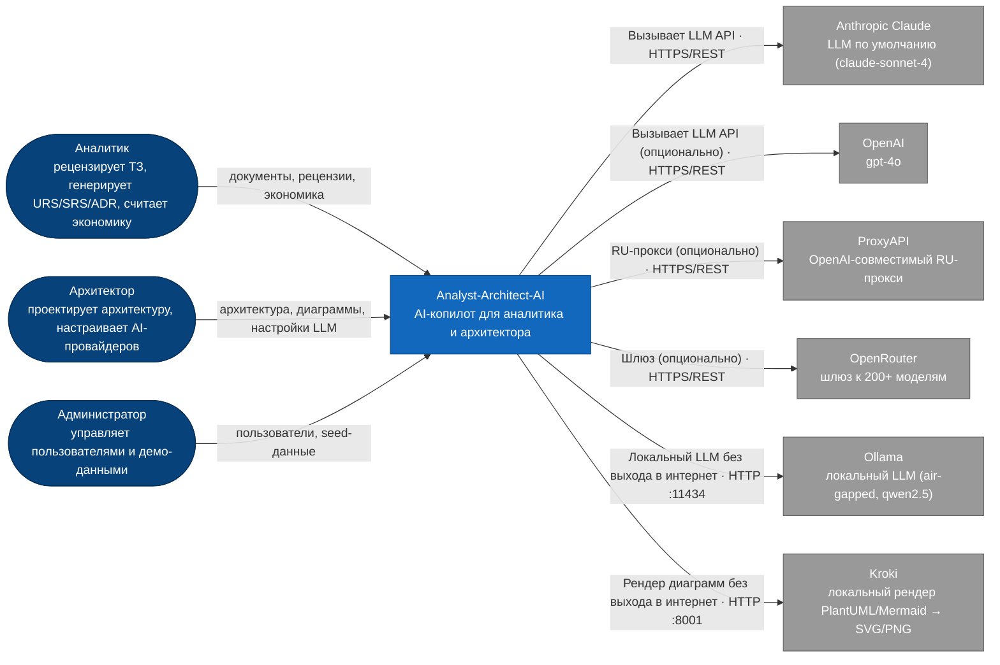
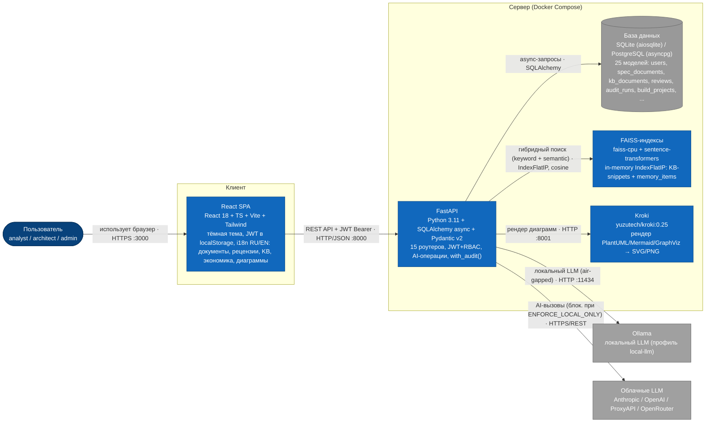
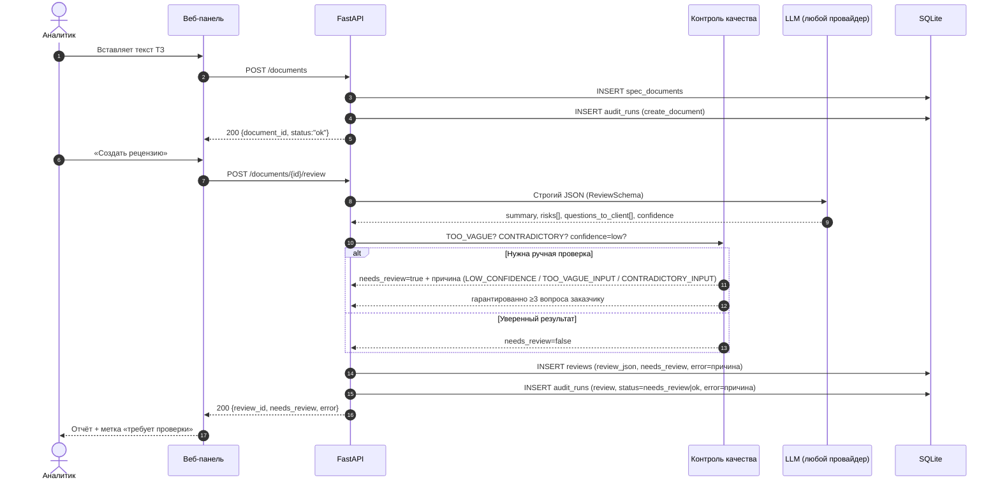
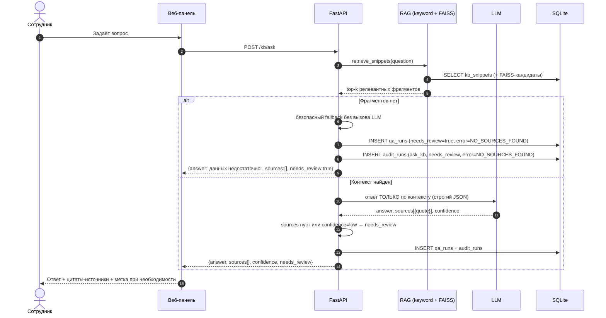

# Analyst-Architect-AI

> **AI-копилот системного аналитика и архитектора решений** — объединяет функциональность
> [MatveiV/Analyst-Guru](https://github.com/MatveiV/Analyst-Guru) и расширенного прототипа
> с авторизацией/RBAC/i18n в единый продукт, дополненный **модулем экономической оценки
> и окупаемости** для приложений, создаваемых через платформу.

Цель проекта — максимально заменить рутинные обязанности аналитика и архитектора:
рецензия ТЗ, проектирование архитектуры, генерация ADR/URS/SRS/API/диаграмм, управление
знаниями команды **и теперь — расчёт бизнес-кейса (CAPEX/OPEX/ROI/срок окупаемости)**
для каждого проекта, который команда строит с помощью системы.

---

## Что нового по сравнению с исходными проектами

Этот репозиторий — результат слияния двух источников. Подробное сравнение и план
объединения — в [docs/MERGE_PLAN.md](docs/MERGE_PLAN.md). Кратко:

| Взято из | Что именно |
|---|---|
| Прототип (RBAC/i18n) | JWT-авторизация, роли admin/analyst/architect, i18n RU/EN (200+ ключей), настройки 5 AI-провайдеров с детекцией и тестом соединения для любой роли |
| `MatveiV/Analyst-Guru` | Reasoning-режимы (Chain-of-Thought / ReAct), Dashboard-эндпоинты, Seed-примеров через API |
| **Новое в этом репозитории** | **Модуль экономики**: build-проекты, AI-декомпозиция задач, расчёт CAPEX/OPEX/ROI/payback, план/факт, экспорт бизнес-кейса в DOCX/PDF |

---

## Архитектура системы

```
3A/
├── backend/                    # FastAPI + SQLAlchemy (async)
│   ├── app/
│   │   ├── main.py             # FastAPI app, lifespan, RBAC на роутерах
│   │   ├── config.py           # Настройки из .env (os.getenv)
│   │   ├── database.py         # async engine, Base, Alembic→create_all fallback
│   │   ├── models/             # 25 SQLAlchemy моделей (spec_documents, kb_documents, kb_snippets, ...)
│   │   ├── schemas/            # Pydantic v2 схемы
│   │   ├── services/
│   │   │   ├── llm_client.py        # 5 провайдеров: Anthropic / OpenAI / ProxyAPI / OpenRouter / Ollama
│   │   │   ├── llm_pricing.py       # Тарификация токенов по провайдерам (для usage_economics)
│   │   │   ├── ai_reviewer.py        # Рецензия ТЗ, reasoning modes (direct/cot/react)
│   │   │   ├── rag_engine.py         # Гибридный RAG (keyword 40% + semantic 60%)
│   │   │   ├── embeddings.py         # sentence-transformers all-MiniLM-L6-v2
│   │   │   ├── diagram_engine.py     # C4/UML/ERD, Kroki-рендер, версионирование
│   │   │   ├── adr_generator.py      # Генерация ADR
│   │   │   ├── architecture_engine.py # Рекомендации по архитектуре
│   │   │   ├── doc_generator.py      # URS/SRS генерация
│   │   │   ├── memory_service.py     # 5-типовой фреймворк памяти
│   │   │   ├── audit_service.py      # with_audit(): провенанс всех AI-операций
│   │   │   ├── diff_service.py       # Сравнение двух рецензий (до/после изменения ТЗ)
│   │   │   ├── task_estimator.py     # ★ AI-декомпозиция задач
│   │   │   ├── economics_service.py  # ★ CAPEX/OPEX/ROI/payback (детерминированно)
│   │   │   ├── usage_economics_service.py # ★ Факт LLM-расходов из audit_runs
│   │   │   ├── batch_review_service.py # ★ Пакетная рецензия (до 50 ТЗ)
│   │   │   ├── kb_autoindex.py       # ★ Авто-индексация URS/SRS/ADR в KB
│   │   │   ├── review_to_catalog.py  # ★ Извлечение рисков из рецензий
│   │   │   ├── standards_seed.py     # ГОСТ 34 / ISO 29148 / IEEE 830
│   │   │   ├── export_service.py     # DOCX/PDF/CSV/JSON экспорт
│   │   │   └── auth_service.py       # JWT (HS256) + bcrypt
│   │   └── api/routers/        # 15 роутеров
│   │       ├── auth.py, documents.py, reviews.py, knowledge_base.py,
│   │       │   memory.py, diagrams.py, audit.py, standards.py, settings.py
│   │       ├── build_projects.py     # ★ Экономический модуль
│   │       ├── dashboard.py          # ★ Сводная панель + actual-usage
│   │       ├── batch_reviews.py      # ★ Пакетная рецензия
│   │       ├── risk_catalog.py, lessons.py
│   │       └── seed.py               # ★ Демо-данные одной кнопкой (admin only)
│   ├── alembic/versions/       # 7 миграций (0001–0007, включая разделение documents)
│   └── tests/                  # 160 pytest тестов
├── frontend/                   # React 18 + TypeScript + Vite + Tailwind
│   └── src/pages/               # Login, Documents, DocumentDetail, Reviews,
│                                 # BatchReview, ArchStudio, KnowledgeBase, Memory,
│                                 # Audit, RiskCatalog, Lessons, Economics ★,
│                                 # Dashboard ★, Settings, Users
├── tests_data/                 # 10 тестовых ТЗ + KB-документы + вопросы
├── docs/
│   ├── MERGE_PLAN.md            # План объединения и роадмап
│   ├── user-guide-{ru,en}.md   # Руководство пользователя (C4/UML)
│   ├── admin-guide-{ru,en}.md  # Руководство администратора (deployment)
│   ├── graduation-report.md
│   └── defense-script.md
├── docker-compose.yml           # backend + frontend + kroki (+ ollama profile)
└── .env.example
```

### C4 Level 1 — Контекст системы



> При `ENFORCE_LOCAL_ONLY=true` вызовы облачных LLM (Anthropic/OpenAI) из этой схемы заблокированы.

### C4 Level 2 — Контейнеры



### Схема данных (ER) — Вариант 2 и Вариант 5 в общей БД

> После миграции `0007_split_documents` рецензируемые ТЗ и статьи базы знаний
> физически разведены: **`spec_documents`** (Вариант 2) и **`kb_documents`** + **`kb_snippets`**
> (Вариант 5). Общий аудит всех операций — **`audit_runs`**.

```mermaid
erDiagram
    SPEC_DOCUMENTS ||--o{ REVIEWS : "рецензируется"
    SPEC_DOCUMENTS ||--o{ REQUIREMENTS_DOCUMENTS : "URS/SRS"
    SPEC_DOCUMENTS ||--o{ DIAGRAM_ARTIFACTS : "диаграммы"
    SPEC_DOCUMENTS ||--o{ ARCHITECTURE_REVIEWS : "рекомендации"
    SPEC_DOCUMENTS ||--o{ ADR_RECORDS : "ADR"
    SPEC_DOCUMENTS ||--o{ API_SPECS : "OpenAPI"
    SPEC_DOCUMENTS ||--o{ BUILD_PROJECTS : "бизнес-кейс"
    KB_DOCUMENTS ||--o{ KB_SNIPPETS : "нарезается на фрагменты"
    KB_DOCUMENTS ||--o{ QA_RUNS : "источник ответа"

    SPEC_DOCUMENTS {
        string id PK
        datetime created_at
        string title
        text text
        string doc_type "tz|brd|user_story|srs|markdown"
        string project_name
        string default_requirements_standard
        string default_diagram_standard
    }
    REVIEWS {
        string id PK
        datetime created_at
        string document_id FK
        text review_json
        bool needs_review
        string confidence
        string error "LOW_CONFIDENCE|TOO_VAGUE_INPUT|CONTRADICTORY_INPUT|INVALID_JSON"
    }
    KB_DOCUMENTS {
        string id PK
        datetime created_at
        string title
        text text
        string project_name
        string source_type "urs|srs|adr|diagrams|lesson"
        string source_id
    }
    KB_SNIPPETS {
        string id PK
        datetime created_at
        string document_id FK
        text snippet_text
        blob embedding
    }
    QA_RUNS {
        string id PK
        datetime created_at
        string question
        text answer
        text sources_json
        bool needs_review
        string error "NO_SOURCES_FOUND|LOW_CONFIDENCE|INVALID_JSON|LLM_ERROR"
    }
    AUDIT_RUNS {
        string id PK
        datetime created_at
        string action
        text input
        text output
        string status "ok|needs_review|error"
        string error
        int duration_ms
    }
    REQUIREMENTS_DOCUMENTS {
        string id PK
        string document_id FK
        string doc_kind "urs|srs"
    }
    DIAGRAM_ARTIFACTS {
        string id PK
        string document_id FK
        string diagram_type
        string notation
    }
    ARCHITECTURE_REVIEWS {
        string id PK
        string document_id FK
        bool needs_review
    }
    ADR_RECORDS {
        string id PK
        string document_id FK
    }
    API_SPECS {
        string id PK
        string document_id FK
    }
    BUILD_PROJECTS {
        string id PK
        string document_id FK
    }
```



---

## Роли и авторизация

| Роль | Доступ |
|------|--------|
| **Аналитик** (`analyst`) | Документы, рецензии, batch-рецензии, KB, память, диаграммы, аудит, стандарты, risk-catalog, lessons, **build-проекты и оценка экономики**, **настройки LLM-провайдеров** |
| **Архитектор** (`architect`) | Все функции аналитика |
| **Администратор** (`admin`) | Всё + **управление пользователями** + **seed-данные** (bulk-загрузка) |

Аутентификация: OAuth2 password flow → JWT (HS256, срок 8 часов), пароли — bcrypt. Проверка роли через зависимости `require_analyst` / `require_admin`. Настройки AI-провайдеров (`/settings/*`) доступны **любой** аутентифицированной роли — каждый пользователь задаёт свой ключ и тестирует соединение.

Тестовые учётные записи (сменить перед продакшн!):

```
admin      / admin123
analyst    / analyst123
architect  / architect123
```

---

## Быстрый старт

```bash
git clone https://github.com/MatveiV/Analyst-Architect-AI.git
cd Analyst-Architect-AI
cp .env.example .env
nano .env   # вставьте API-ключ и APP_SECRET_KEY (openssl rand -hex 32)

docker-compose up --build
# Backend:  http://localhost:8000/docs
# Frontend: http://localhost:3000
```

### Запуск с локальным Ollama (без облачных ключей)

Приложение работает полностью **offline** с локальным LLM — API-ключи облачных сервисов не нужны.

```bash
# 1. Установите Ollama (https://ollama.com)
#    Windows: https://ollama.com/download/windows
#    macOS:   https://ollama.com/download/mac
#    Linux:   curl -fsSL https://ollama.com/install.sh | sh

# 2. Скачайте модель
ollama pull qwen2.5

# 3. Сконфигурируйте .env для локального режима
cat > .env << 'EOF'
LLM_PROVIDER=ollama
OLLAMA_BASE_URL=http://127.0.0.1:11434/v1
OLLAMA_MODEL=qwen2.5
LLM_TIMEOUT=2400
ENFORCE_LOCAL_ONLY=true
APP_SECRET_KEY=$(openssl rand -hex 32)
DATABASE_URL=sqlite:///./data/analyst_architect_ai.db
EOF

# 4. Запустите (Docker Compose поднимет Ollama внутри контейнера)
docker-compose --profile local-llm up --build
```

**Важно:**
- `LLM_TIMEOUT=2400` — CPU-модели генерируют ответ за 2–5 минут; без поднятия таймаута запросы обрываются и уходят в `needs_review=true`.
- `ENFORCE_LOCAL_ONLY=true` — блокирует все исходящие HTTPS-вызовы; остаются только локальные Ollama + Kroki (air-gapped-режим).
- Стоимость LLM-вызовов = **$0** (см. «Модуль экономики» ниже).
- Профиль `local-llm` в `docker-compose.yml` поднимает контейнер `ollama/ollama` на порту 11434; если Ollama уже установлен на хосте, задайте `OLLAMA_BASE_URL=http://host.docker.internal:11434` (Win/Mac) или `http://172.17.0.1:11434` (Linux).

### Быстрая загрузка демо-данных (после первого входа как admin)

```bash
TOKEN=$(curl -s -X POST http://localhost:8000/auth/login \
  -d "username=admin&password=admin123" | python3 -c "import sys,json;print(json.load(sys.stdin)['access_token'])")

curl -X POST http://localhost:8000/seed/examples -H "Authorization: Bearer $TOKEN"
```

---

## Флагманская фича: модуль экономики и окупаемости

Каждый ТЗ/BRD, загруженный в систему, можно превратить в **build-проект** и получить
для него полноценный бизнес-кейс без единой ручной формулы в Excel:

```bash
# 1. Создать build-проект на основе документа
curl -X POST http://localhost:8000/build-projects -H "Authorization: Bearer $TOKEN" \
  -d '{"document_id":"<id>","name":"CRM для отдела продаж"}'

# 2. AI-декомпозиция требований на задачи (story points → часы по ролям)
curl -X POST http://localhost:8000/build-projects/<id>/estimate-tasks \
  -H "Authorization: Bearer $TOKEN"

# 3. Расчёт CAPEX/OPEX/ROI/payback по прозрачной формуле
curl -X POST http://localhost:8000/build-projects/<id>/economic-estimate \
  -H "Authorization: Bearer $TOKEN" \
  -d '{"time_saved_hours_monthly": 100, "avg_employee_rate": 2500}'

# 4. После внедрения — внести факт для план/факт анализа
curl -X POST http://localhost:8000/build-projects/<id>/actuals \
  -H "Authorization: Bearer $TOKEN" \
  -d '{"actual_capex": 620000, "actual_benefit_monthly": 380000}'

# 5. Экспорт готового бизнес-кейса в DOCX
curl http://localhost:8000/build-projects/<id>/export/docx \
  -H "Authorization: Bearer $TOKEN" -o business_case.docx
```

### Формулы (прозрачные, без чёрного ящика)

```
CAPEX          = Σ(hours_by_role × hourly_rate_by_role)
OPEX/мес       = hosting + LLM-токены + support_hours × ставка
Выгода/мес     = time_saved_hours × средняя ставка сотрудника
Payback (мес)  = CAPEX / (Выгода/мес − OPEX/мес)
ROI 12мес, %   = ((Выгода/мес − OPEX/мес) × 12 − CAPEX) / CAPEX × 100
```

AI участвует только в оценке часов (`task_estimator.py`); все финансовые расчёты
выполняются детерминированно в Python (`economics_service.py`) — воспроизводимо и
проверяемо, без "галлюцинаций" в цифрах.

---

## Reasoning-режимы (Chain-of-Thought / ReAct)

Для AI-рецензии доступны три режима — управляются полем `reasoning_mode`
(`direct` | `cot` | `react`):

```bash
curl -X POST http://localhost:8000/ai/review -H "Authorization: Bearer $TOKEN" \
  -d '{"text": "...", "reasoning_mode": "cot"}'
```

- **direct** — прямой вызов (по умолчанию, самый быстрый/дешёвый)
- **cot** — модель рассуждает по шагам в блоке `<thinking>` перед выдачей JSON
- **react** — цикл Thought/Action/Observation в блоке `<reasoning>` перед JSON

---

## Конфигурация (.env)

| Переменная | Описание | По умолчанию |
|-----------|----------|-------------|
| `LLM_PROVIDER` | `anthropic` \| `openai` \| `proxyapi` \| `openrouter` \| `ollama` | `anthropic` |
| `ANTHROPIC_API_KEY` / `OPENAI_API_KEY` | Ключи облачных провайдеров | — |
| `PROXYAPI_KEY` / `PROXYAPI_BASE_URL` / `PROXYAPI_MODEL` | RU-прокси (OpenAI-совместимый) | — |
| `OPENROUTER_API_KEY` / `OPENROUTER_BASE_URL` / `OPENROUTER_ROUTE` | Шлюз к 200+ моделям | — |
| `OLLAMA_BASE_URL` / `OLLAMA_MODEL` | Локальный LLM (air-gapped) | `http://ollama:11434/v1` / `qwen2.5:14b-instruct` |
| `ENFORCE_LOCAL_ONLY` | `true` = запрет любых внешних сетевых вызовов | `false` |
| `DIAGRAM_RENDERER_URL` / `DIAGRAM_RENDERER_TIMEOUT` | Kroki для локального рендера диаграмм | `http://kroki:8000` / `30` |
| `APP_SECRET_KEY` | Секрет для подписи JWT (мин. 32 символа) | — (обязательно сменить) |
| `DATABASE_URL` | SQLite или PostgreSQL | `sqlite+aiosqlite:///./data/analyst_architect_ai.db` |
| `MAX_DOCUMENT_LENGTH` | Макс. длина документа | `30000` |
| `RAG_TOP_K` | Число фрагментов для RAG | `5` |
| `LLM_TEMPERATURE` / `LLM_MAX_TOKENS` | Параметры LLM | `0.2` / `4096` |
| `LLM_TIMEOUT` | Таймаут одного LLM-вызова, секунды. Для локальных моделей (Ollama на CPU) поднимайте до `2400`+ — иначе долгая генерация обрывается и уходит в safe-fallback (`needs_review=true`) | `600` |
| `LLM_COST_USD_TO_RUB` | Курс для пересчёта факт. расходов LLM | `90.0` |

> Рантайм-переключение провайдера возможно через БД (`/settings/providers`, доступно любой роли) — настройки в БД имеют приоритет над `.env`.

---

## API эндпоинты (полный список)

### Аутентификация
`POST /auth/login` · `GET /auth/me` · `POST /auth/register` (admin) · `GET /auth/users` (admin) ·
`PATCH /auth/users/{id}` (admin) · `POST /auth/users/{id}/reset-password` (admin)

### Документы и рецензии
`POST /documents` · `GET /documents` · `POST /documents/upload-markdown` ·
`POST /documents/{id}/review?reasoning_mode=cot` ·
`POST /documents/{id}/generate-{urs,srs,adr}` · `POST /documents/{id}/recommend-architecture` ·
`POST /documents/{id}/design-api` · `POST /documents/{id}/generate-diagrams` ·
`PATCH /documents/{id}/standards` ·
`GET /documents/{id}/requirements-documents` ·
`GET /documents/{id}/export/{docx,markdown}` · `GET /documents/{id}/export/full-package/docx` ·
`POST /ai/review` · `GET /reviews` · `GET /reviews/{id}` · `GET /reviews/diff?from_id=&to_id=` ·
`GET /reviews/{id}/export/{json,csv}` ·
`GET /requirements-documents/{id}` · `GET /documents/{id}/coverage`

### ★ Batch-рецензии (Phase 2)
`POST /batch-reviews` (до 50 ТЗ) · `GET /batch-reviews` · `GET /batch-reviews/{id}` · `GET /batch-reviews/{id}/export/csv`

### База знаний (RAG) + автоиндексация (Phase 3)
`POST /kb/documents` · `GET /kb/documents` · `POST /kb/ask` · `GET /kb/history` · `POST /kb/reindex` · `POST /ai/answer_with_sources`
> Сгенерированные URS/SRS/ADR/диаграммы автоматически индексируются в KB (миграция 0006, сервис `kb_autoindex.py`)

### Память (5 типов)
`POST /memory/store` · `POST /memory/search` · `GET /memory/recent?memory_type=` · `POST /memory/consolidate`

### Диаграммы + версионирование (Phase 1)
`GET /diagrams/{id}` · `GET /diagrams/document/{id}?notation=` ·
`POST /diagrams/generate-{c4,uml,erd}` · `PUT /diagrams/{id}` ·
`GET /diagrams/{id}/versions` · `POST /diagrams/{id}/rollback/{n}`

### Стандарты, риски, уроки
`GET /standards?family=requirements|diagram` · `PATCH /documents/{id}/standards` ·
`GET /risk-catalog` · `POST /risk-catalog` · `GET /risk-catalog/{id}` ·
`PUT /risk-catalog/{id}` · `DELETE /risk-catalog/{id}` ·
`GET /risk-catalog/stats` · `GET /risk-catalog/export/csv` ·
`GET /lessons` · `POST /lessons` · `GET /lessons/{id}` · `PUT /lessons/{id}` · `DELETE /lessons/{id}` ·
`GET /lessons/export/csv`

### Аудит
`GET /audit` · `GET /audit/stats`

### ★ Экономика (build-проекты)
`POST /build-projects` · `GET /build-projects` · `POST /build-projects/{id}/estimate-tasks` ·
`POST /build-projects/{id}/economic-estimate?use_actual_llm_cost=true` · `POST /build-projects/{id}/actuals` (architect+) ·
`GET /build-projects/{id}/report` · `GET /build-projects/{id}/export/{docx,pdf}`

### ★ Dashboard
`GET /dashboard/stats` · `GET /dashboard/recent-activity` · `GET /dashboard/stats-by-provider` · `GET /dashboard/actual-usage`

### ★ Seed (демо-данные, admin only)
`POST /seed/documents` · `POST /seed/kb-documents` · `POST /seed/examples`
> `/seed/examples` идемпотентно загружает 10 ТЗ/BRD/US + 5 KB-статей + риски/уроки/память (если ещё не загружено). В UI запускается кнопкой «Загрузить примеры для всех процессов» в Settings.

### Настройка AI-провайдеров (любая роль)
`GET /settings/providers` · `POST /settings/providers` · `POST /settings/providers/activate?provider=` ·
`POST /settings/test` (тест соединения по введённой конфигурации, можно до сохранения) ·
`POST /settings/detect` (определение провайдера по API-ключу / Base URL) ·
`GET /settings/active` ·
`GET /settings/providers/ollama/models`

---

## Тестирование

```bash
cd backend
python -m pytest tests/ -v --asyncio-mode=auto
```

| Категория | Тестов |
|-----------|--------|
| Авторизация и RBAC | auth |
| AI Reviewer + RAG + Reasoning modes (CoT/ReAct) | main |
| **Phase 1 / Epic A** — diagram engine, Kroki, версионирование, rollback | epic_a_diagrams |
| **Phase 1 / Epic B** — стандарты документации (ГОСТ 34 / ISO 29148 / IEEE 830) | epic_b_standards |
| **Phase 1 / Epic C** — Ollama, ENFORCE_LOCAL_ONLY | epic_c_ollama |
| **Phase 2** — batch-review (до 50 ТЗ), coverage-счётчики, review diff | phase2_* |
| **Phase 3** — KB-autoindexing, usage↔economics (actual LLM cost) | phase3_* |
| Выпускные варианты 2+5 — наличие обязательных эндпоинтов групп A/B, структура `tests_data` | graduation_requirements |
| Экономический модуль (CAPEX/OPEX/ROI формулы + API) | economics |
| **Настройки LLM-провайдеров для любой роли** (сохранение ключа, тест соединения, детекция провайдера) | test_settings_provider |
| **Итого** | **160** ✅ |

> 160/160 тестов проходят; TypeScript: 0 ошибок (`tsc --noEmit`); production-build фронтенда — чистый. Frontend E2E-тестов нет (в roadmap).

---

## Выпускные варианты 2+5: API, тестовые данные, аудит

Проект реализует одновременно **Вариант 2 (ИИ-рецензент ТЗ)** и **Вариант 5 (Система знаний команды)** как разделы одного продукта (общие БД и `audit_runs`).

### База данных и аудит
- **БД по умолчанию:** `backend/data/analyst_architect_ai.db` (SQLite). Задаётся `DATABASE_URL`.
- **Посмотреть аудит:** `GET /audit` (все запуски) и `GET /audit/stats` (сводка). Каждый вызов групп A и B (включая `/ai/review`, `/ai/answer_with_sources` и создание документов) пишет строку в `audit_runs` через `with_audit()`/`save_audit()`; при ручной проверке `audit_runs.error` содержит причину (`TOO_VAGUE_INPUT`, `CONTRADICTORY_INPUT`, `LOW_CONFIDENCE`, `NO_SOURCES_FOUND`, `INVALID_JSON`, `LLM_ERROR`).

### Группа A — ИИ-рецензент (Вариант 2)
```bash
TOKEN=$(curl -s -X POST http://localhost:8000/auth/login \
  -d "username=analyst&password=analyst123" | python3 -c "import sys,json;print(json.load(sys.stdin)['access_token'])")

# 1) Создать документ («сырьё» для рецензии)
curl -X POST http://localhost:8000/documents -H "Authorization: Bearer $TOKEN" \
  -H "Content-Type: application/json" \
  -d '{"title":"Форма заявок","text":"Нужна форма заявки с полями имя, email, телефон, статусы и таблицей результатов администратора. Требуется авторизация."}'

# 2) Запустить рецензию (DOC_ID — из ответа п.1, поле id) → создаст запись в reviews + audit_runs
curl -X POST http://localhost:8000/documents/DOC_ID/review -H "Authorization: Bearer $TOKEN"

# 3) Чистая ИИ-операция (строгий JSON: summary, risks[], questions_to_client[], confidence, needs_review)
curl -X POST http://localhost:8000/ai/review -H "Authorization: Bearer $TOKEN" \
  -H "Content-Type: application/json" -d '{"text":"Сделать сайт."}'
```

### Группа B — Система знаний (Вариант 5)
```bash
# 1) Добавить документ в базу знаний
curl -X POST http://localhost:8000/kb/documents -H "Authorization: Bearer $TOKEN" \
  -H "Content-Type: application/json" \
  -d '{"title":"Правила команды","text":"Рабочие часы 10:00-19:00 МСК. Ответ в чате — в течение 2 рабочих часов. Код ревью обязателен."}'

# 2) Вопрос → ответ с источниками (sources[]) или needs_review=true
curl -X POST http://localhost:8000/kb/ask -H "Authorization: Bearer $TOKEN" \
  -H "Content-Type: application/json" -d '{"question":"Какой SLA на ответы в команде?"}'

# 3) Чистая ИИ-операция (строгий JSON: answer, sources[], confidence, needs_review)
curl -X POST http://localhost:8000/ai/answer_with_sources -H "Authorization: Bearer $TOKEN" \
  -H "Content-Type: application/json" -d '{"question":"Что такое ADR?","context":"ADR — запись об архитектурном решении."}'
```

### Как воспроизвести «ручную проверку» тестом
Готовые входы лежат в `tests_data/` (10 ТЗ, 5 KB-документов, 10 вопросов). Быстро проверить ручную проверку без ключа провайдера — юнит/контрактными тестами:
```bash
cd backend
python -m pytest tests/test_graduation_requirements.py -q          # наличие всех эндпоинтов обеих групп + структура данных
python -m pytest tests/test_main.py::TestAIReviewerLogic -q        # TOO_VAGUE/CONTRADICTORY → needs_review=true
```
Реальные входы из `tests_data` прогоняются через `/seed/examples` (admin) + `/kb/ask`, результат фиксируется в `tests_data/RESULTS.md`.

### Тестовые данные (`tests_data/`)
#### ТЗ (Вариант 2) — `tests_data/specs/specs.jsonl`
| № | Тема | expected `needs_review` | Почему | Что считается успехом |
|---|---|---|---|---|
| 1–6 | Нормальные мини-ТЗ (форма заявки, парсер цен, учёт оплат, кабинет, витрина, генератор PDF) | false | Есть функциональные/НФ-требования и критерии | ≥3 риска и ≥4-5 критериев приёмки |
| 7 | «Сделать сайт» (1 предложение) | true | `TOO_VAGUE_INPUT` | 3+ вопроса заказчику, `confidence=low` |
| 8 | «Прилож.» (1 слово) | true | вырожденный ввод | `needs_review=true`, `confidence=low` |
| 9 | Авторизация/открытый доступ + сроки | true | `CONTRADICTORY_INPUT` | `needs_review=true`, риск `severity=high` |
| 10 | Чат-бот: автономность vs модерация | true | `CONTRADICTORY_INPUT` | `needs_review=true`, риск `severity=high` |

#### База знаний (Вариант 5)
- `tests_data/kb_documents.jsonl` — 5 документов (правила команды, FAQ клиентов, шаблоны ответов, словарь терминов, процесс запуска задачи), каждый 20–50 строк.

`tests_data/kb_questions.jsonl` — 10 вопросов: **7** с ответом в базе (`expected_needs_review=false`, есть источники) и **3** без ответа (`expected_needs_review=true` → «данных недостаточно»).

| № | Вопрос (кратко) | Ожидаемый `needs_review` | Почему | На какой документ опираемся |
|---|---|---|---|---|
| 1 | SLA на ответы внутри команды | false | Ответ есть в правилах | «Правила работы команды» |
| 2 | Как оформить возврат клиенту | false | Ответ есть в FAQ | «Частые вопросы клиентов» |
| 3 | Шаги перед деплоем в production | false | Ответ есть в процессе | «Процесс запуска задачи» |
| 4 | Что такое ADR | false | Ответ есть в словаре | «Словарь терминов» |
| 5 | Шаблон ответа при эскалации | false | Ответ есть в шаблонах | «Шаблоны ответов» |
| 6 | Как проводится code review | false | Ответ есть в правилах | «Правила работы команды» |
| 7 | Что такое RPO и чем отличается от RTO | false | Ответ есть в словаре | «Словарь терминов» |
| 8 | Библиотека для работы с PDF на Python | true | В базе знаний нет | — |
| 9 | Настройка CI/CD пайплайна в GitLab | true | DevOps-документов нет | — |
| 10 | Стоимость подписки | true | Финансовых документов нет | — |

### Поток Варианта 2 — ИИ-рецензент ТЗ



### Поток Варианта 5 — Система знаний команды



---

## Сдача проекта (чек-лист артефактов по `InitialTask.md`)

| # | Требование InitialTask | Где лежит |
|---|------------------------|-----------|
| 1 | Ссылка на репозиторий без секретов | https://github.com/MatveiV/Analyst-Architect-AI · проверка секретов: `git grep -I -n -E "(sk-[A-Za-z0-9]{16,}|AKIA[0-9A-Z]{16}|BEGIN [A-Z ]*PRIVATE KEY)" HEAD` → пусто |
| 2 | README (запуск ≤ 10 мин, переменные окружения, примеры запросов, где БД, как воспроизвести ручную проверку) | этот файл: «Быстрый старт» §, «Конфигурация (.env)» §, «Группа A/B — примеры curl» §, «Как воспроизвести ручную проверку» § |
| 3 | `.env.example` без секретов | [`.env.example`](.env.example) |
| 4 | Dockerfile + docker-compose.yml | [`backend/Dockerfile`](backend/Dockerfile), [`frontend/Dockerfile`](frontend/Dockerfile), [`docker-compose.yml`](docker-compose.yml) |
| 5 | 10 тестовых входов (ТЗ + KB), включая 2–3 с `needs_review=true` | [`tests_data/specs/specs.jsonl`](tests_data/specs/specs.jsonl) (10 ТЗ), [`tests_data/kb_documents.jsonl`](tests_data/kb_documents.jsonl) (5), [`tests_data/kb_questions.jsonl`](tests_data/kb_questions.jsonl) (10) — таблицы ожиданий в § «Тестовые данные» |
| 6 | Доказательства работы: audit_runs на каждое действие + скриншоты (успешный сценарий, ручная проверка с меткой и причиной, витрина, экспорт) | скриншоты: [`docs/screenshots/`](docs/screenshots/) (9 шт.); сырые выгрузки: [`tests_data/evidence/`](tests_data/evidence/) (audit-runs.json, reviews-list.json, review-export.json/csv, kb-history.json); отчёт E2E на реальном LLM: [`tests_data/RESULTS.md`](tests_data/RESULTS.md) |
| 7 | Демо-видео 2–4 минуты | сценарий съёмки: [`docs/demo-recording-guide.md`](docs/demo-recording-guide.md) (запись по шагам с таймингом) — видео записывается по этому сценарию |
| 8 | Защита 5–7 минут | сценарий: [`docs/defense-script.md`](docs/defense-script.md) (пошаговый текст речи + тайминг) |
| 9 | Отчёт по шаблону | [`docs/graduation-report.md`](docs/graduation-report.md) |

---

## Документация

| Документ | Описание |
|---------|----------|
| [docs/MERGE_PLAN.md](docs/MERGE_PLAN.md) | Сравнение проектов, план объединения, роадмап |
| [docs/user-guide-ru.md](docs/user-guide-ru.md) / [-en.md](docs/user-guide-en.md) | Руководство пользователя с C4/UML |
| [docs/admin-guide-ru.md](docs/admin-guide-ru.md) / [-en.md](docs/admin-guide-en.md) | Руководство администратора |
| [docs/graduation-report.md](docs/graduation-report.md) | Отчёт с мини-экономикой (курсовой формат) |
| [docs/defense-script.md](docs/defense-script.md) | Сценарий защиты проекта |
| [docs/demo-recording-guide.md](docs/demo-recording-guide.md) | Сценарий съёмки демо-видео 2–4 мин |
| [docs/screenshots/](docs/screenshots/) | Скриншоты-доказательства (витрина, рецензия, ручная проверка, аудит, экспорт) |

---

## Roadmap

- **v1.0** — текущий релиз: FastAPI + 15 роутеров, 25 моделей, 21 сервис, 160 pytest, React 18 + Vite, модуль экономики
- **v1.1** — Alembic-миграции (7 шт., 0001–0007, включая разделение `spec_documents`/`kb_documents`) ✅, batch-рецензия (Phase 2) ✅, webhook при `needs_review` — в работе
- **v1.2** — Vite + Tailwind ✅, OpenRouter provider ✅, ENFORCE_LOCAL_ONLY ✅, Kroki-рендер ✅; shadcn/ui / TanStack Query — в работе
- **v1.3** — Интеграция Economic Actuals с тайм-трекерами (Toggl/Harvest) для автосбора факта
- **v2.0** — Fine-tuned модель на корпоративных ТЗ, портфельный dashboard ROI по всем build-проектам компании

---

## Лицензия

Apache-2.0 (см. `LICENSE`)
