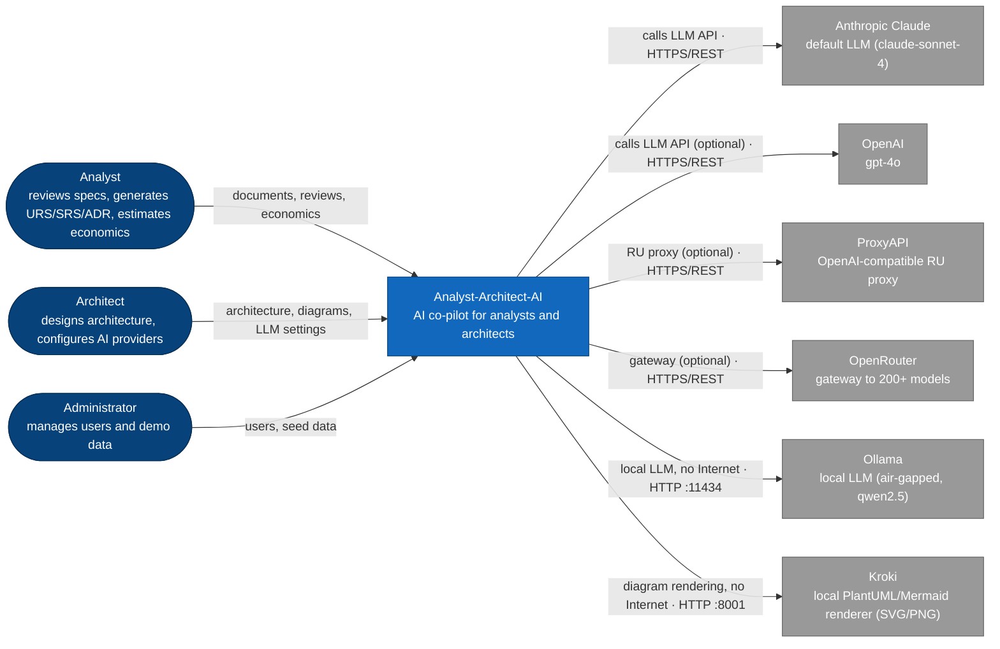
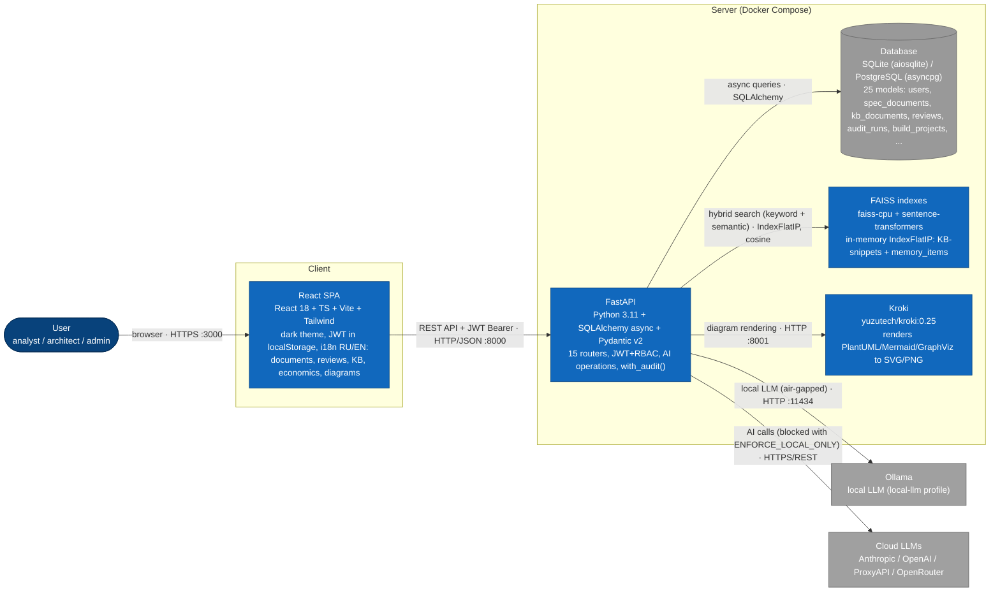
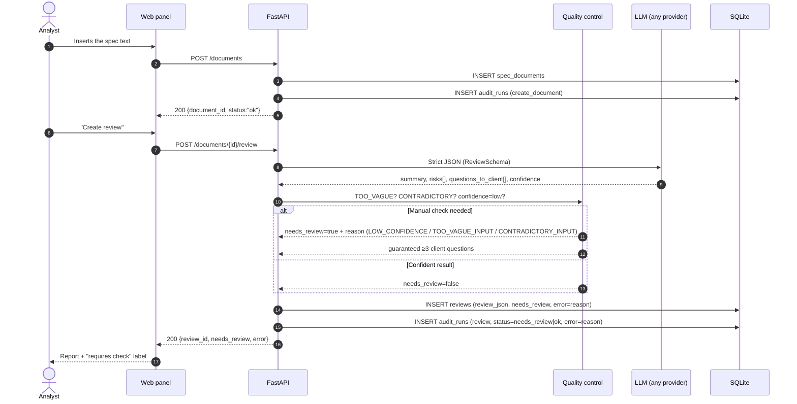
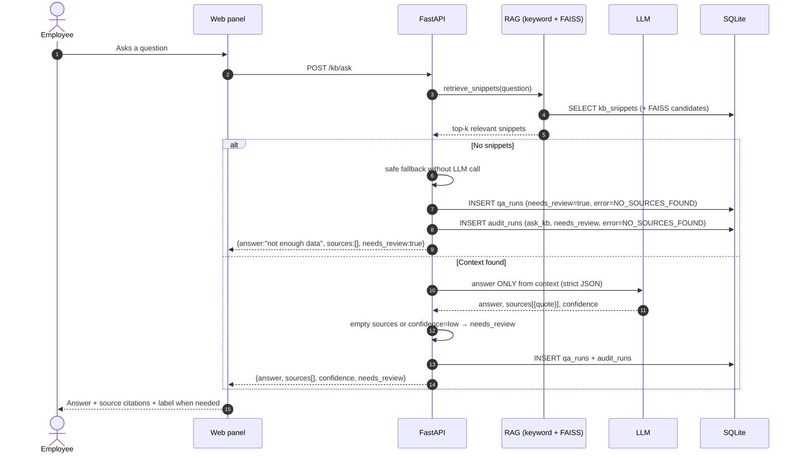

# Analyst-Architect-AI

🇷🇺 [Русская версия](README.md)

> **AI co-pilot for systems analysts and solution architects** — merges the functionality of
> [MatveiV/Analyst-Guru](https://github.com/MatveiV/Analyst-Guru) and an extended prototype with
> auth/RBAC/i18n into a single product, enhanced with an **economic evaluation and ROI module**
> for the applications the team builds through the platform.

## Goals & Objectives

The platform automates the routine work of a systems analyst and a solution architect, covering
the full requirements-management cycle — from intake of a "raw" specification to a business case
and design documentation ready for development handoff.

| # | Objective | What gets automated |
|---|-----------|---------------------|
| 1 | **Fast, honest spec review** | AI analysis of completeness, correctness and consistency of requirements; risks, clarifying questions for the author, acceptance criteria; honest `needs_review`/`confidence` labels instead of an "always correct" answer |
| 2 | **Batch requirements check** | Up to 50 specs in a single run with a summary report and CSV export |
| 3 | **Requirements formalization** | URS/SRS generation per GOST 34.602-2020 / ISO/IEC/IEEE 29148 / IEEE 830 |
| 4 | **Solution architecture design** | Architecture recommendations, ADR, OpenAPI 3.1 and 8 diagram types (C4/UML/ERD) with versioning; rendering locally via Kroki |
| 5 | **Team knowledge management** | RAG knowledge base: document upload, auto-indexing, answers with source citations; "not enough data" instead of hallucinations |
| 6 | **Capturing project experience** | Catalog of typical risks (probability/impact/mitigation) and Lessons Learned, reused across projects |
| 7 | **Economic evaluation before development** | AI task decomposition, effort estimation by role, CAPEX/OPEX/ROI/payback, plan-vs-actual, business-case export to DOCX/PDF |
| 8 | **Transparency & audit** | Every AI operation is written to `audit_runs` with the manual-review reason and actual LLM-call cost |
| 9 | **Security & autonomy** | JWT + RBAC (admin/analyst/architect); `ENFORCE_LOCAL_ONLY` mode — fully offline operation on a local Ollama |

## Core Business Functions & Processes

| Business process | Who uses it | How it works in the system | Result |
|------------------|-------------|----------------------------|--------|
| **Spec review** | Analyst | Upload a spec → AI completeness/consistency check → risks, questions for the client, acceptance criteria, `needs_review`/`confidence` labels → manual check when required | Review report + export DOCX/JSON/CSV |
| **Batch requirements audit** | Analyst | Up to 50 specs in one run → shared execution → summary report and CSV | Batch report |
| **URS/SRS generation** | Analyst | Formalize a spec per the selected standard (GOST/ISO/IEEE) → finished document + auto-indexing into the knowledge base | URS/SRS documents |
| **Architecture & ADR** | Architect | Architecture recommendation → ADR → OpenAPI → C4/UML/ERD diagrams with versions and rollback | Design documentation package |
| **Team knowledge base** | Entire team | Upload articles → auto-indexing (keyword + FAISS) → questions answered with source citations | Verifiable answers |
| **Risks & lessons** | Analyst / team | Auto-extraction of risks from reviews into the catalog → manual additions → CSV export | Risk catalog and Lessons Learned |
| **Project economics** | Analyst / architect | Build project from a spec → task decomposition → hour estimate → CAPEX/OPEX/ROI/payback → plan-vs-actual | Business case + DOCX/PDF export |
| **LLM budget control** | All roles | Transparent per-provider token pricing; local models (Ollama) cost $0 | Actual spend in the Dashboard |
| **Demo-environment administration** | Administrator | User management; demo data with one click (`POST /seed/examples`) | Ready product showcase |

---

## What's New vs. the Source Projects

This repository merges two sources. The detailed comparison and merge plan are in
[docs/MERGE_PLAN.md](docs/MERGE_PLAN.md). In short:

| Taken from | What exactly |
|---|---|
| Prototype (RBAC/i18n) | JWT auth, roles admin/analyst/architect, RU/EN i18n (200+ keys), settings for 5 AI providers with detection and connection test for any role |
| `MatveiV/Analyst-Guru` | Reasoning modes (Chain-of-Thought / ReAct), Dashboard endpoints, example seeding via API |
| **New in this repository** | **Economics module**: build projects, AI task decomposition, CAPEX/OPEX/ROI/payback calculation, plan-vs-actual, business-case export to DOCX/PDF |

---

## System Architecture

```
3A/
├── backend/                    # FastAPI + SQLAlchemy (async)
│   ├── app/
│   │   ├── main.py             # FastAPI app, lifespan, RBAC on routers
│   │   ├── config.py           # .env settings (os.getenv)
│   │   ├── database.py         # async engine, Base, Alembic→create_all fallback
│   │   ├── models/             # 25 SQLAlchemy models (spec_documents, kb_documents, kb_snippets, ...)
│   │   ├── schemas/            # Pydantic v2 schemas
│   │   ├── services/
│   │   │   ├── llm_client.py        # 5 providers: Anthropic / OpenAI / ProxyAPI / OpenRouter / Ollama
│   │   │   ├── llm_pricing.py       # Per-provider token pricing (for usage_economics)
│   │   │   ├── ai_reviewer.py        # Spec review, reasoning modes (direct/cot/react)
│   │   │   ├── rag_engine.py         # Hybrid RAG (keyword 40% + semantic 60%)
│   │   │   ├── embeddings.py         # sentence-transformers all-MiniLM-L6-v2
│   │   │   ├── diagram_engine.py     # C4/UML/ERD, Kroki rendering, versioning
│   │   │   ├── adr_generator.py      # ADR generation
│   │   │   ├── architecture_engine.py # Architecture recommendations
│   │   │   ├── doc_generator.py      # URS/SRS generation
│   │   │   ├── memory_service.py     # 5-type memory framework
│   │   │   ├── audit_service.py      # with_audit(): provenance of all AI operations
│   │   │   ├── diff_service.py       # Compare two reviews (before/after spec change)
│   │   │   ├── task_estimator.py     # ★ AI task decomposition
│   │   │   ├── economics_service.py  # ★ CAPEX/OPEX/ROI/payback (deterministic)
│   │   │   ├── usage_economics_service.py # ★ Actual LLM spend from audit_runs
│   │   │   ├── batch_review_service.py # ★ Batch review (up to 50 specs)
│   │   │   ├── kb_autoindex.py       # ★ Auto-indexing of URS/SRS/ADR into the KB
│   │   │   ├── review_to_catalog.py  # ★ Risk extraction from reviews
│   │   │   ├── standards_seed.py     # GOST 34 / ISO 29148 / IEEE 830
│   │   │   ├── export_service.py     # DOCX/PDF/CSV/JSON export
│   │   │   └── auth_service.py       # JWT (HS256) + bcrypt
│   │   └── api/routers/        # 15 routers
│   │       ├── auth.py, documents.py, reviews.py, knowledge_base.py,
│   │       │   memory.py, diagrams.py, audit.py, standards.py, settings.py
│   │       ├── build_projects.py     # ★ Economics module
│   │       ├── dashboard.py          # ★ Summary dashboard + actual-usage
│   │       ├── batch_reviews.py      # ★ Batch review
│   │       ├── risk_catalog.py, lessons.py
│   │       └── seed.py               # ★ Demo data with one click (admin only)
│   ├── alembic/versions/       # 7 migrations (0001–0007, incl. documents split)
│   └── tests/                  # 160 pytest tests
├── frontend/                   # React 18 + TypeScript + Vite + Tailwind
│   └── src/pages/               # Login, Documents, DocumentDetail, Reviews,
│                                 # BatchReview, ArchStudio, KnowledgeBase, Memory,
│                                 # Audit, RiskCatalog, Lessons, Economics ★,
│                                 # Dashboard ★, Settings, Users
├── tests_data/                 # 10 test specs + KB documents + questions
├── docs/
│   ├── MERGE_PLAN.md            # Merge plan and roadmap
│   ├── user-guide-{ru,en}.md   # User guide (C4/UML)
│   ├── admin-guide-{ru,en}.md  # Administrator guide (deployment)
│   ├── graduation-report.md
│   └── defense-script.md
├── docker-compose.yml           # backend + frontend + kroki (+ ollama profile)
└── .env.example
```

### C4 Level 1 — System Context



> With `ENFORCE_LOCAL_ONLY=true`, cloud LLM calls (Anthropic/OpenAI) from this diagram are blocked.

### C4 Level 2 — Containers



### Data Model (ER)

> After the `0007_split_documents` migration, reviewed specs and knowledge-base articles are
> physically separated: **`spec_documents`** (AI reviewer) and **`kb_documents`** + **`kb_snippets`**
> (knowledge base). All operations share the **`audit_runs`** audit trail.

```mermaid
erDiagram
    SPEC_DOCUMENTS ||--o{ REVIEWS : "reviewed by"
    SPEC_DOCUMENTS ||--o{ REQUIREMENTS_DOCUMENTS : "URS/SRS"
    SPEC_DOCUMENTS ||--o{ DIAGRAM_ARTIFACTS : "diagrams"
    SPEC_DOCUMENTS ||--o{ ARCHITECTURE_REVIEWS : "recommendations"
    SPEC_DOCUMENTS ||--o{ ADR_RECORDS : "ADR"
    SPEC_DOCUMENTS ||--o{ API_SPECS : "OpenAPI"
    SPEC_DOCUMENTS ||--o{ BUILD_PROJECTS : "business case"
    KB_DOCUMENTS ||--o{ KB_SNIPPETS : "split into snippets"
    KB_DOCUMENTS ||--o{ QA_RUNS : "answer source"

    SPEC_DOCUMENTS {
        string id PK
        datetime created_at
        string title
        text text
        string doc_type "tz|brd|user_story|srs|markdown"
        string project_name
        string default_requirements_standard
        string default_diagram_standard
    }
    REVIEWS {
        string id PK
        datetime created_at
        string document_id FK
        text review_json
        bool needs_review
        string confidence
        string error "LOW_CONFIDENCE|TOO_VAGUE_INPUT|CONTRADICTORY_INPUT|INVALID_JSON"
    }
    KB_DOCUMENTS {
        string id PK
        datetime created_at
        string title
        text text
        string project_name
        string source_type "urs|srs|adr|diagrams|lesson"
        string source_id
    }
    KB_SNIPPETS {
        string id PK
        datetime created_at
        string document_id FK
        text snippet_text
        blob embedding
    }
    QA_RUNS {
        string id PK
        datetime created_at
        string question
        text answer
        text sources_json
        bool needs_review
        string error "NO_SOURCES_FOUND|LOW_CONFIDENCE|INVALID_JSON|LLM_ERROR"
    }
    AUDIT_RUNS {
        string id PK
        datetime created_at
        string action
        text input
        text output
        string status "ok|needs_review|error"
        string error
        int duration_ms
    }
    REQUIREMENTS_DOCUMENTS {
        string id PK
        string document_id FK
        string doc_kind "urs|srs"
    }
    DIAGRAM_ARTIFACTS {
        string id PK
        string document_id FK
        string diagram_type
        string notation
    }
    ARCHITECTURE_REVIEWS {
        string id PK
        string document_id FK
        bool needs_review
    }
    ADR_RECORDS {
        string id PK
        string document_id FK
    }
    API_SPECS {
        string id PK
        string document_id FK
    }
    BUILD_PROJECTS {
        string id PK
        string document_id FK
    }
```



---

## Roles & Authorization

| Role | Access |
|------|--------|
| **Analyst** (`analyst`) | Documents, reviews, batch reviews, KB, memory, diagrams, audit, standards, risk catalog, lessons, **build projects and economics**, **LLM provider settings** |
| **Architect** (`architect`) | Everything an analyst has |
| **Administrator** (`admin`) | Everything + **user management** + **seed data** (bulk load) |

Authentication: OAuth2 password flow → JWT (HS256, 8-hour TTL), passwords hashed with bcrypt.
Role checks via `require_analyst` / `require_admin` dependencies. AI-provider settings
(`/settings/*`) are available to **any** authenticated role — each user configures their own
key and tests the connection.

Test accounts (change before production!):

```
admin      / admin123
analyst    / analyst123
architect  / architect123
```

---

## Quick Start

### Docker (recommended)

```bash
git clone https://github.com/MatveiV/Analyst-Architect-AI.git
cd Analyst-Architect-AI
cp .env.example .env
nano .env   # insert an API key and APP_SECRET_KEY (openssl rand -hex 32)

docker-compose up --build
# Backend:  http://localhost:8000/docs
# Frontend: http://localhost:3000
```

### Run locally without Docker

```bash
# 1. Backend (terminal 1)
cd backend
python -m venv .venv && .venv\Scripts\activate     # Windows (.venv/bin/activate on Linux/macOS)
pip install -r requirements.txt
cp ../.env.example .env                            # set LLM_PROVIDER (+ key) and APP_SECRET_KEY
uvicorn app.main:app --reload --port 8000
# OpenAPI: http://localhost:8000/docs

# 2. Frontend (terminal 2)
cd frontend
npm install
npm run start                                      # Vite → http://localhost:3000 (proxy → :8000)
```

> **Test accounts:** `admin/admin123`, `analyst/analyst123`, `architect/architect123`.
> Demo data for all sections is loaded with the **📥 Load examples for all processes** button
> on the ⚙️ Settings page (admin) or via `POST /seed/examples`.

### Run with a local Ollama (no cloud keys, offline)

The product works fully **offline** with a local LLM — no cloud API keys required.

```bash
# 1. Install Ollama (https://ollama.com)
#    Windows: https://ollama.com/download/windows
#    macOS:   https://ollama.com/download/mac
#    Linux:   curl -fsSL https://ollama.com/install.sh | sh

# 2. Pull a model
ollama pull qwen2.5

# 3. Configure .env for local mode
cat > .env << 'EOF'
LLM_PROVIDER=ollama
OLLAMA_BASE_URL=http://127.0.0.1:11434/v1
OLLAMA_MODEL=qwen2.5
LLM_TIMEOUT=2400
ENFORCE_LOCAL_ONLY=true
APP_SECRET_KEY=$(openssl rand -hex 32)
DATABASE_URL=sqlite:///./data/analyst_architect_ai.db
EOF

# 4. Start (Docker Compose launches Ollama inside a container)
docker-compose --profile local-llm up --build
```

**Important:**
- `LLM_TIMEOUT=2400` — CPU models generate within 2–5 minutes; without a higher timeout requests
  abort into the safe fallback with `needs_review=true`.
- `ENFORCE_LOCAL_ONLY=true` — blocks all outbound HTTPS calls; only local Ollama + Kroki remain
  (air-gapped mode).
- LLM cost is **$0** (see the Economics module below).
- The `local-llm` profile in `docker-compose.yml` starts an `ollama/ollama` container on port
  11434; if Ollama is already on the host, set `OLLAMA_BASE_URL=http://host.docker.internal:11434`
  (Win/Mac) or `http://172.17.0.1:11434` (Linux).

### Load demo data (after first login as admin)

```bash
TOKEN=$(curl -s -X POST http://localhost:8000/auth/login \
  -d "username=admin&password=admin123" | python3 -c "import sys,json;print(json.load(sys.stdin)['access_token'])")

curl -X POST http://localhost:8000/seed/examples -H "Authorization: Bearer $TOKEN"
```

---

## Flagship Feature: Economics & ROI Module

Any spec/BRD uploaded to the system can become a **build project** and get a complete business
case without a single manual formula in Excel:

```bash
# 1. Create a build project from a document
curl -X POST http://localhost:8000/build-projects -H "Authorization: Bearer $TOKEN" \
  -d '{"document_id":"<id>","name":"CRM for the sales department"}'

# 2. AI task decomposition (story points → hours by role)
curl -X POST http://localhost:8000/build-projects/<id>/estimate-tasks \
  -H "Authorization: Bearer $TOKEN"

# 3. CAPEX/OPEX/ROI/payback calculation via transparent formulas
curl -X POST http://localhost:8000/build-projects/<id>/economic-estimate \
  -H "Authorization: Bearer $TOKEN" \
  -d '{"time_saved_hours_monthly": 100, "avg_employee_rate": 2500}'

# 4. After deployment — record actuals for plan-vs-actual analysis
curl -X POST http://localhost:8000/build-projects/<id>/actuals \
  -H "Authorization: Bearer $TOKEN" \
  -d '{"actual_capex": 620000, "actual_benefit_monthly": 380000}'

# 5. Export the business case to DOCX
curl http://localhost:8000/build-projects/<id>/export/docx \
  -H "Authorization: Bearer $TOKEN" -o business_case.docx
```

### Formulas (transparent, no black box)

```
CAPEX          = SUM(hours_by_role × hourly_rate_by_role)
OPEX/mo        = hosting + LLM tokens + support_hours × rate
Benefit/mo     = time_saved_hours × average employee rate
Payback (mo)   = CAPEX / (Benefit/mo − OPEX/mo)
ROI 12mo, %    = ((Benefit/mo − OPEX/mo) × 12 − CAPEX) / CAPEX × 100
```

AI only estimates hours (`task_estimator.py`); all financial calculations run deterministically
in Python (`economics_service.py`) — reproducible and verifiable, no "hallucinations" in numbers.

---

## Reasoning Modes (Chain-of-Thought / ReAct)

AI review supports three modes controlled by the `reasoning_mode` field (`direct` | `cot` | `react`):

```bash
curl -X POST http://localhost:8000/ai/review -H "Authorization: Bearer $TOKEN" \
  -d '{"text": "...", "reasoning_mode": "cot"}'
```

- **direct** — direct call (default, fastest/cheapest)
- **cot** — the model reasons step by step in a `<thinking>` block before emitting JSON
- **react** — Thought/Action/Observation loop in a `<reasoning>` block before JSON

---

## Configuration (.env)

| Variable | Description | Default |
|----------|-------------|---------|
| `LLM_PROVIDER` | `anthropic` \| `openai` \| `proxyapi` \| `openrouter` \| `ollama` | `anthropic` |
| `ANTHROPIC_API_KEY` / `OPENAI_API_KEY` | Cloud provider keys | — |
| `PROXYAPI_KEY` / `PROXYAPI_BASE_URL` / `PROXYAPI_MODEL` | RU proxy (OpenAI-compatible) | — |
| `OPENROUTER_API_KEY` / `OPENROUTER_BASE_URL` / `OPENROUTER_ROUTE` | Gateway to 200+ models | — |
| `OLLAMA_BASE_URL` / `OLLAMA_MODEL` | Local LLM (air-gapped) | `http://ollama:11434/v1` / `qwen2.5:14b-instruct` |
| `ENFORCE_LOCAL_ONLY` | `true` = block any external network calls | `false` |
| `DIAGRAM_RENDERER_URL` / `DIAGRAM_RENDERER_TIMEOUT` | Kroki for local diagram rendering | `http://kroki:8000` / `30` |
| `APP_SECRET_KEY` | JWT signing secret (min 32 chars) | — (must be changed) |
| `DATABASE_URL` | SQLite or PostgreSQL | `sqlite+aiosqlite:///./data/analyst_architect_ai.db` |
| `MAX_DOCUMENT_LENGTH` | Max document length | `30000` |
| `RAG_TOP_K` | Number of RAG chunks | `5` |
| `LLM_TEMPERATURE` / `LLM_MAX_TOKENS` | LLM parameters | `0.2` / `4096` |
| `LLM_TIMEOUT` | Timeout for a single LLM call, seconds. For local models (Ollama) on CPU raise to `2400`+ — otherwise long generation aborts into safe-fallback (`needs_review=true`) | `600` |
| `LLM_COST_USD_TO_RUB` | FX rate for actual LLM cost conversion | `90.0` |

> Runtime provider switching is possible via the DB (`/settings/providers`, available to any
> role) — DB settings take precedence over `.env`.

---

## API Endpoints (full list)

### Authentication
`POST /auth/login` · `GET /auth/me` · `POST /auth/register` (admin) · `GET /auth/users` (admin) ·
`PATCH /auth/users/{id}` (admin) · `POST /auth/users/{id}/reset-password` (admin)

### Documents & reviews
`POST /documents` · `GET /documents` · `POST /documents/upload-markdown` ·
`POST /documents/{id}/review?reasoning_mode=cot` ·
`POST /documents/{id}/generate-{urs,srs,adr}` · `POST /documents/{id}/recommend-architecture` ·
`POST /documents/{id}/design-api` · `POST /documents/{id}/generate-diagrams` ·
`PATCH /documents/{id}/standards` ·
`GET /documents/{id}/requirements-documents` ·
`GET /documents/{id}/export/{docx,markdown}` · `GET /documents/{id}/export/full-package/docx` ·
`POST /ai/review` · `GET /reviews` · `GET /reviews/{id}` · `GET /reviews/diff?from_id=&to_id=` ·
`GET /reviews/{id}/export/{json,csv}` ·
`GET /requirements-documents/{id}` · `GET /documents/{id}/coverage`

### ★ Batch reviews (Phase 2)
`POST /batch-reviews` (up to 50 specs) · `GET /batch-reviews` · `GET /batch-reviews/{id}` · `GET /batch-reviews/{id}/export/csv`

### Knowledge base (RAG) + auto-indexing (Phase 3)
`POST /kb/documents` · `GET /kb/documents` · `POST /kb/ask` · `GET /kb/history` · `POST /kb/reindex` · `POST /ai/answer_with_sources`
> Generated URS/SRS/ADR/diagrams are automatically indexed into the KB (migration 0006, `kb_autoindex.py`)

### Memory (5 types)
`POST /memory/store` · `POST /memory/search` · `GET /memory/recent?memory_type=` · `POST /memory/consolidate`

### Diagrams + versioning (Phase 1)
`GET /diagrams/{id}` · `GET /diagrams/document/{id}?notation=` ·
`POST /diagrams/generate-{c4,uml,erd}` · `PUT /diagrams/{id}` ·
`GET /diagrams/{id}/versions` · `POST /diagrams/{id}/rollback/{n}`

### Standards, risks, lessons
`GET /standards?family=requirements|diagram` · `PATCH /documents/{id}/standards` ·
`GET /risk-catalog` · `POST /risk-catalog` · `GET /risk-catalog/{id}` ·
`PUT /risk-catalog/{id}` · `DELETE /risk-catalog/{id}` ·
`GET /risk-catalog/stats` · `GET /risk-catalog/export/csv` ·
`GET /lessons` · `POST /lessons` · `GET /lessons/{id}` · `PUT /lessons/{id}` · `DELETE /lessons/{id}` ·
`GET /lessons/export/csv`

### Audit
`GET /audit` · `GET /audit/stats`

### ★ Economics (build projects)
`POST /build-projects` · `GET /build-projects` · `POST /build-projects/{id}/estimate-tasks` ·
`POST /build-projects/{id}/economic-estimate?use_actual_llm_cost=true` · `POST /build-projects/{id}/actuals` (architect+) ·
`GET /build-projects/{id}/report` · `GET /build-projects/{id}/export/{docx,pdf}`

### ★ Dashboard
`GET /dashboard/stats` · `GET /dashboard/recent-activity` · `GET /dashboard/stats-by-provider` · `GET /dashboard/actual-usage`

### ★ Seed (demo data, admin only)
`POST /seed/documents` · `POST /seed/kb-documents` · `POST /seed/examples`
> `/seed/examples` idempotently loads 10 specs/BRD/US + 5 KB articles + risks/lessons/memory
> (if not already loaded). In the UI it runs via the "Load examples for all processes" button in Settings.

### AI-provider settings (any role)
`GET /settings/providers` · `POST /settings/providers` · `POST /settings/providers/activate?provider=` ·
`POST /settings/test` (connection test for an entered configuration, before saving) ·
`POST /settings/detect` (provider detection by API key / Base URL) ·
`GET /settings/active` ·
`GET /settings/providers/ollama/models`

---

## Testing

```bash
cd backend
python -m pytest tests/ -v --asyncio-mode=auto
```

| Category | Tests |
|----------|-------|
| Auth & RBAC | auth |
| AI Reviewer + RAG + Reasoning modes (CoT/ReAct) | main |
| **Phase 1 / Epic A** — diagram engine, Kroki, versioning, rollback | epic_a_diagrams |
| **Phase 1 / Epic B** — documentation standards (GOST 34 / ISO 29148 / IEEE 830) | epic_b_standards |
| **Phase 1 / Epic C** — Ollama, ENFORCE_LOCAL_ONLY | epic_c_ollama |
| **Phase 2** — batch review (up to 50 specs), coverage counters, review diff | phase2_* |
| **Phase 3** — KB auto-indexing, usage↔economics (actual LLM cost) | phase3_* |
| Delivery options 2+5 — presence of mandatory group A/B endpoints, `tests_data` structure | graduation_requirements |
| Economics module (CAPEX/OPEX/ROI formulas + API) | economics |
| **LLM-provider settings for any role** (key storage, connection test, provider detection) | test_settings_provider |
| **Total** | **160** ✅ |

> 160/160 tests pass; TypeScript: 0 errors (`tsc --noEmit`); clean frontend production build.
> No frontend E2E tests yet (in the roadmap).

---

## Use Cases: AI Reviewer & Team Knowledge Base

The project implements both the **AI spec reviewer** and the **team knowledge base** as sections
of one product (shared DB and `audit_runs`).

### Database & audit
- **Default DB:** `backend/data/analyst_architect_ai.db` (SQLite), set via `DATABASE_URL`.
- **View the audit:** `GET /audit` (all runs) and `GET /audit/stats` (summary). Every group A and B
  call (including `/ai/review`, `/ai/answer_with_sources` and document creation) writes a row to
  `audit_runs` via `with_audit()`/`save_audit()`; on manual review, `audit_runs.error` holds the
  reason (`TOO_VAGUE_INPUT`, `CONTRADICTORY_INPUT`, `LOW_CONFIDENCE`, `NO_SOURCES_FOUND`,
  `INVALID_JSON`, `LLM_ERROR`).

### Group A — AI reviewer
```bash
TOKEN=$(curl -s -X POST http://localhost:8000/auth/login \
  -d "username=analyst&password=analyst123" | python3 -c "import sys,json;print(json.load(sys.stdin)['access_token'])")

# 1) Create a document (the "raw material" for a review)
curl -X POST http://localhost:8000/documents -H "Authorization: Bearer $TOKEN" \
  -H "Content-Type: application/json" \
  -d '{"title":"Request form","text":"Need a request form with fields name, email, phone, statuses and an admin results table. Authentication is required."}'

# 2) Run a review (DOC_ID — the id from step 1) → writes to reviews + audit_runs
curl -X POST http://localhost:8000/documents/DOC_ID/review -H "Authorization: Bearer $TOKEN"

# 3) A bare AI operation (strict JSON: summary, risks[], questions_to_client[], confidence, needs_review)
curl -X POST http://localhost:8000/ai/review -H "Authorization: Bearer $TOKEN" \
  -H "Content-Type: application/json" -d '{"text":"Build a website."}'
```

### Group B — Team knowledge base
```bash
# 1) Add a document to the knowledge base
curl -X POST http://localhost:8000/kb/documents -H "Authorization: Bearer $TOKEN" \
  -H "Content-Type: application/json" \
  -d '{"title":"Team rules","text":"Working hours 10:00-19:00 MSK. Reply in chat within 2 working hours. Code review is mandatory."}'

# 2) Ask a question → answer with sources[] or needs_review=true
curl -X POST http://localhost:8000/kb/ask -H "Authorization: Bearer $TOKEN" \
  -H "Content-Type: application/json" -d '{"question":"What is the SLA for team replies?"}'

# 3) A bare AI operation (strict JSON: answer, sources[], confidence, needs_review)
curl -X POST http://localhost:8000/ai/answer_with_sources -H "Authorization: Bearer $TOKEN" \
  -H "Content-Type: application/json" -d '{"question":"What is an ADR?","context":"ADR — an architecture decision record."}'
```

### How to reproduce the "manual check" with a test
Ready inputs live in `tests_data/` (10 specs, 5 KB documents, 10 questions). To quickly verify
the manual-check path without a provider key — unit/contract tests:
```bash
cd backend
python -m pytest tests/test_graduation_requirements.py -q          # all endpoints of both groups + data structure
python -m pytest tests/test_main.py::TestAIReviewerLogic -q        # TOO_VAGUE/CONTRADICTORY → needs_review=true
```
Real inputs from `tests_data` are executed via `/seed/examples` (admin) + `/kb/ask`, and the
results are recorded in `tests_data/RESULTS.md`.

### Test data (`tests_data/`)
#### Specs — `tests_data/specs/specs.jsonl`
| # | Topic | expected `needs_review` | Why | Success criteria |
|---|-------|-------------------------|-----|------------------|
| 1–6 | Normal mini specs (request form, price parser, payment tracking, cabinet, showcase, PDF generator) | false | Functional/non-functional requirements and criteria present | ≥3 risks and ≥4-5 acceptance criteria |
| 7 | "Build a website" (one sentence) | true | `TOO_VAGUE_INPUT` | 3+ clarifying questions, `confidence=low` |
| 8 | "App." (one word) | true | degenerate input | `needs_review=true`, `confidence=low` |
| 9 | Auth/open access + deadlines | true | `CONTRADICTORY_INPUT` | `needs_review=true`, risk `severity=high` |
| 10 | Chatbot: autonomy vs. moderation | true | `CONTRADICTORY_INPUT` | `needs_review=true`, risk `severity=high` |

#### Knowledge base
- `tests_data/kb_documents.jsonl` — 5 documents (team rules, client FAQ, answer templates,
  glossary, task-launch process), 20–50 lines each.

`tests_data/kb_questions.jsonl` — 10 questions: **7** answerable from the base
(`expected_needs_review=false`, have sources) and **3** without an answer
(`expected_needs_review=true` → "not enough data").

| # | Question (short) | Expected `needs_review` | Why | Source document |
|---|---|------------------------|-----|-----------------|
| 1 | SLA for team replies | false | Answer in the rules | "Team work rules" |
| 2 | How to process a client refund | false | Answer in the FAQ | "Client FAQ" |
| 3 | Steps before deploying to production | false | Answer in the process | "Task launch process" |
| 4 | What is an ADR | false | Answer in the glossary | "Glossary" |
| 5 | Template for escalation responses | false | Answer in templates | "Answer templates" |
| 6 | How a code review is performed | false | Answer in the rules | "Team work rules" |
| 7 | What is RPO and how it differs from RTO | false | Answer in the glossary | "Glossary" |
| 8 | PDF library for Python | true | Not in the KB | — |
| 9 | Setting up a CI/CD pipeline in GitLab | true | No DevOps documents | — |
| 10 | Subscription price | true | No financial documents | — |

### Flow: AI spec reviewer



### Flow: Team knowledge base



---

## Project Development Paths

### Current status (v1.0)

FastAPI + 15 routers, 25 models, 21 services, **160 pytest tests**, React 18 + Vite, economics
module, a full E2E run on a local LLM.

### Near-term steps

- **v1.1** — webhook notifications on `needs_review`; richer export (GOST-aligned DOCX templates)
- **v1.2** — shadcn/ui and TanStack Query in the frontend; frontend E2E tests (Playwright)
- **v1.3** — integration of economic actuals with time trackers (Toggl/Harvest) for automatic
  plan-vs-actual collection
- **v1.4** — importing specs from Jira/Confluence; live Mermaid rendering in the UI

### Strategic directions

| Direction | Business value |
|-----------|----------------|
| **Full-cycle AI agent** | An autonomous agent "review → spec rework → re-review" until acceptance criteria pass, without human involvement |
| **Fine-tuned model on corporate specs** | A specialized LLM more accurate than generic ones on domain specs (v2.0) |
| **Portfolio ROI dashboard** | Consolidated ROI across all company build projects, investment prioritization (v2.0) |
| **Multi-tenancy / SaaS** | Separate team and project workspaces, SSO/LDAP, data isolation |
| **MCP interface** | Exposing the platform as an MCP server to external AI assistants and IDEs |
| **Cloud deployment** | GitHub Actions → Azure/AWS: managed PostgreSQL, CI/CD, monitoring |
| **More standards** | GOST 19 (ESPD), IDEF0/EPC diagrams, presale reporting templates |

---

## Documentation

| Document | Description |
|----------|-------------|
| [docs/MERGE_PLAN.md](docs/MERGE_PLAN.md) | Source comparison, merge plan, roadmap |
| [docs/user-guide-ru.md](docs/user-guide-ru.md) / [-en.md](docs/user-guide-en.md) | User guide with C4/UML |
| [docs/admin-guide-ru.md](docs/admin-guide-ru.md) / [-en.md](docs/admin-guide-en.md) | Administrator guide |
| [docs/graduation-report.md](docs/graduation-report.md) | Graduation report (coursework format) |
| [docs/defense-script.md](docs/defense-script.md) | Defense script |
| [docs/demo-recording-guide.md](docs/demo-recording-guide.md) | Demo video script (2–4 min) |
| [docs/screenshots/](docs/screenshots/) | Evidence screenshots (showcase, review, manual check, audit, export) |

---

## License

Apache-2.0 (see `LICENSE`)