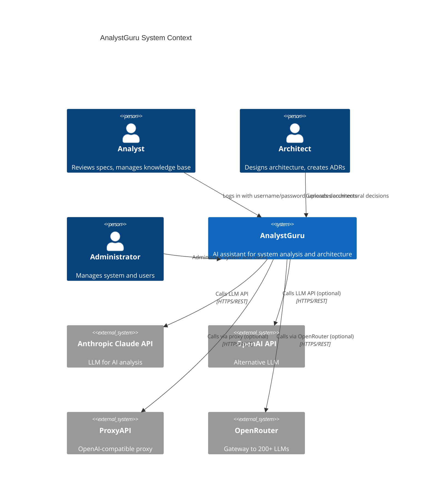
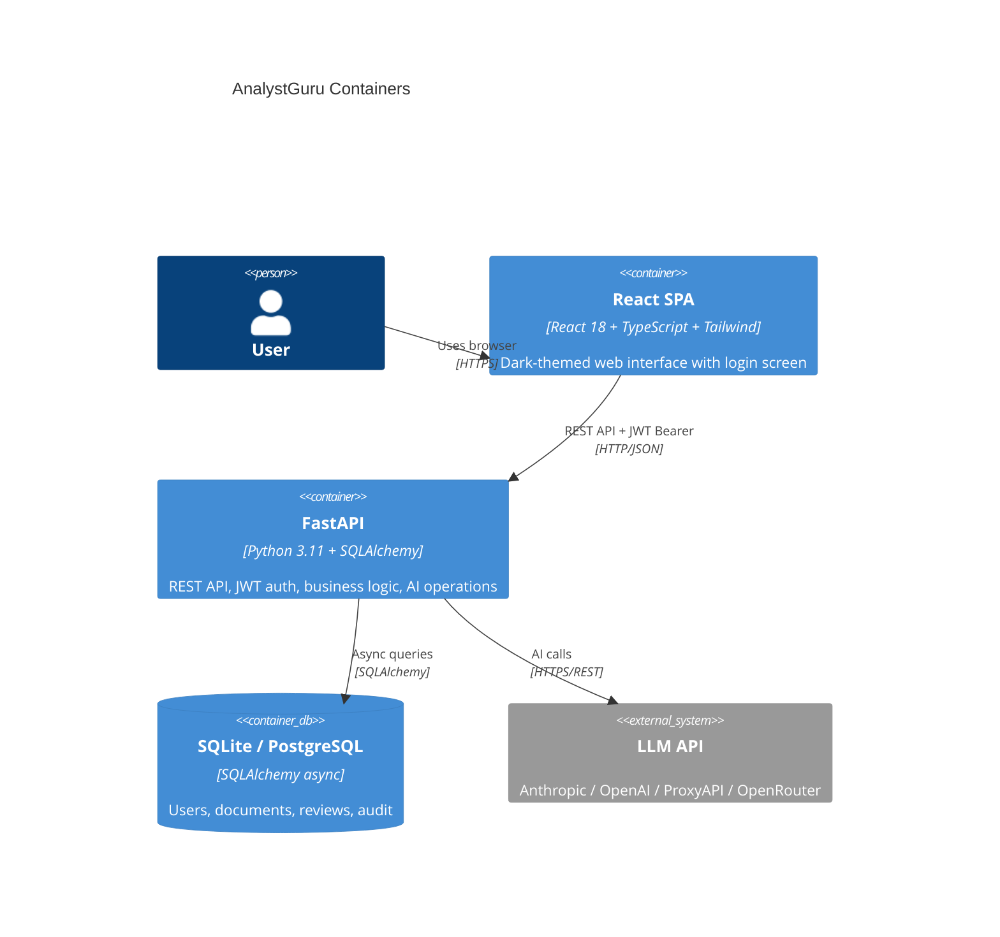
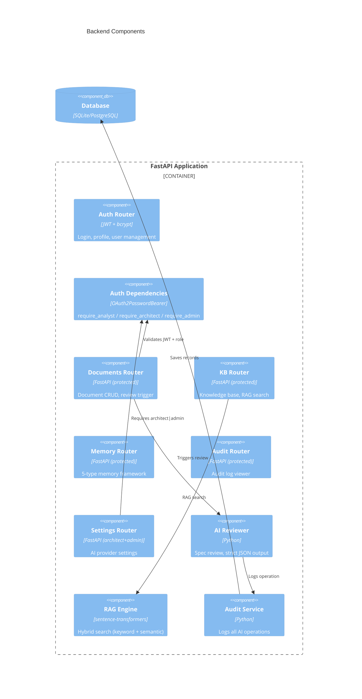
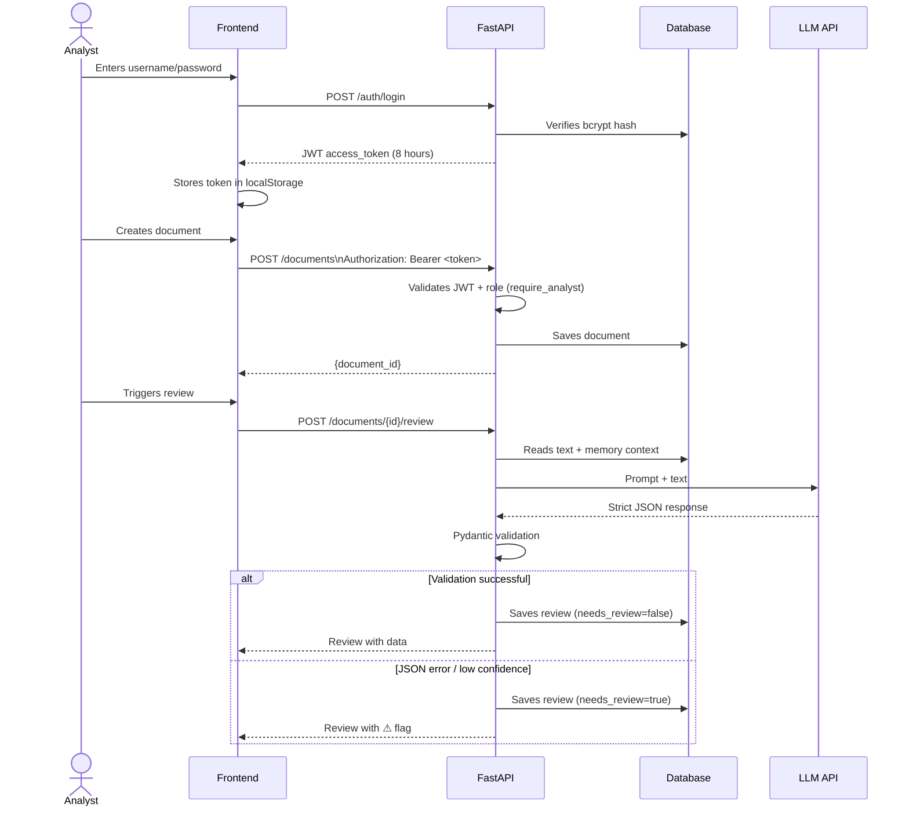
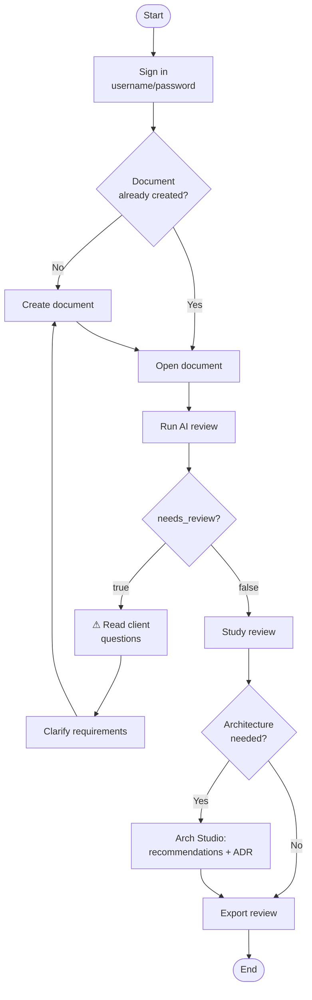
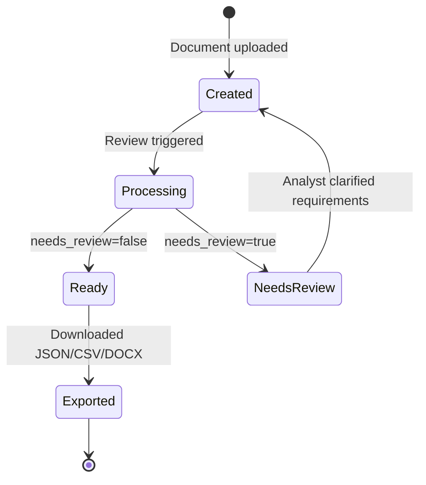
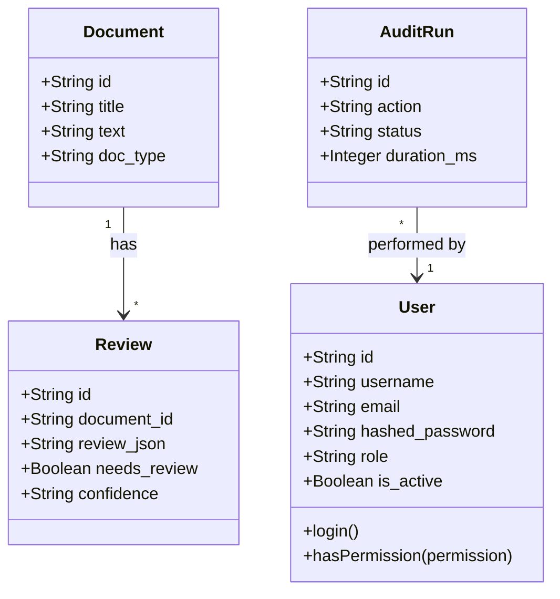

# AnalystGuru User Guide

> **AnalystGuru** — AI assistant for system analysts and solution architects.  
> Version: 1.0.0 | UI Languages: 🇷🇺 Russian / 🇬🇧 English

---

## Table of Contents

1. [Introduction and Roles](#1-introduction-and-roles)
2. [System Architecture (C4)](#2-system-architecture-c4)
3. [Signing In](#3-signing-in)
4. [Business Scenarios by Role](#4-business-scenarios-by-role)
5. [AI Provider Setup](#5-ai-provider-setup)
6. [Working with Documents](#6-working-with-documents)
7. [AI Document Review](#7-ai-document-review)
8. [Architecture Studio](#8-architecture-studio)
9. [Knowledge Base (RAG)](#9-knowledge-base-rag)
10. [Memory Framework](#10-memory-framework)
11. [Audit Center](#11-audit-center)
12. [Project Economics — ROI & Payback](#12-project-economics--roi--payback)
13. [Business Case Export](#13-business-case-export)
14. [UML Workflow Diagrams](#14-uml-workflow-diagrams)

---

## 1. Introduction and Roles

### Who is this for?

AnalystGuru solves the problem of **expensive manual analysis** of technical specifications and architectural decisions. Without the system, an analyst spends 2–4 hours reviewing one specification; with AnalystGuru — 5–10 minutes.

### User Roles

Access to the system requires **mandatory username/password authentication** (JWT token, 8-hour lifetime). Every user is assigned one of three roles:

| Role | Description | Capabilities |
|------|-------------|--------------|
| **Analyst** (`analyst`) | Requirements specialist | Create and review documents, work with knowledge base, manage memory, view audit |
| **Architect** (`architect`) | Software architect | Everything analyst can do + AI provider settings, architecture recommendations, ADR generation |
| **Administrator** (`admin`) | System administrator | Full access + user management (create, roles, block, password reset) |

### Access Matrix

| Feature | Analyst | Architect | Administrator |
|---------|:---:|:---:|:---:|
| Username/password login | ✅ | ✅ | ✅ |
| Create documents | ✅ | ✅ | ✅ |
| AI review | ✅ | ✅ | ✅ |
| Architecture recommendations | ✅ | ✅ | ✅ |
| ADR generation | ✅ | ✅ | ✅ |
| Knowledge base / RAG | ✅ | ✅ | ✅ |
| View audit log | ✅ | ✅ | ✅ |
| AI provider settings | ❌ (403) | ✅ | ✅ |
| User management | ❌ (403) | ❌ (403) | ✅ |

> Restrictions are enforced **on the backend** (JWT + role check), not just hidden in the UI — calling a protected endpoint without the right role returns HTTP 403.

---

## 2. System Architecture (C4)

### C4 Level 1 — System Context



### C4 Level 2 — Containers



### C4 Level 3 — Backend Components



---

## 3. Signing In

### Sign-in Steps

1. Open your browser and navigate to `http://localhost:3000`
2. The system shows the **login screen** (the app is inaccessible without authentication)
3. Enter your **username** and **password**
4. Click the **→ Sign in** button

On success, the backend issues a **JWT token** (valid for 8 hours), stored in the browser and automatically attached to every request. You will land on the main page — the documents list.

### Test Accounts

| Username | Password | Role |
|----------|----------|------|
| `admin` | `admin123` | Administrator |
| `analyst` | `analyst123` | Analyst |
| `architect` | `architect123` | Architect |

The login screen has quick-fill buttons for each of the three roles — handy for demos.

> ⚠️ Change default passwords before going to production!

### Signing Out

The **⎋** button next to your name in the sidebar removes the token from the browser and returns you to the login screen.

### Language Toggle

The 🇬🇧 EN / 🇷🇺 RU button is on the **login page** (top right) and in the **sidebar** (bottom section). Preference is saved in the browser independently of the auth session.

---

## 4. Business Scenarios by Role

### Scenario A: Analyst Reviews a Technical Specification

```
Step 0: Sign in — analyst / analyst123
Step 1: Analyst → [Documents] → [+ New Document]
Step 2: Fill in: title, type = TZ, project, text
Step 3: Click [🔍 Review]
Step 4: AI analyses the document (15–45 sec)
Step 5: Analyst reviews: summary, risks, client questions, acceptance criteria
Step 6: If needs_review=true → ⚠️ Manual check required
Step 7: Export review as JSON / CSV / DOCX
```

### Scenario B: Architect Creates an Architectural Decision

```
Step 0: Sign in — architect / architect123
Step 1: Architect → [Arch Studio]
Step 2: Select a document from the list
Step 3: Click [🏛 Recommend Architecture]
Step 4: Click [📋 Create ADR]
Step 5: Click [🔌 Create API Spec] → OpenAPI 3.1
Step 6: Click [🗺 Generate Diagrams] → C4, UML, ERD, Mermaid

Configure AI provider (architect/admin only):
Step 7: Architect → [⚙️ Settings]
Step 8: Select provider, enter API key, test connection
Step 9: For OpenRouter you can select Route (routing strategy):
      • `openrouter/free` — free models only (default)
      • `openrouter/fusion` — ensemble of 2+ models, returns best result
      • `openrouter/pareto-code` — optimized for coding tasks
Step 10: Configure model, temperature, max tokens (for all providers)
Step 11: Activate provider for the whole team
```

### Scenario C: Analyst Works with the Team Knowledge Base

```
Step 1: Analyst → [Knowledge Base] → [📚 Documents]
Step 2: Adds internal documents (rules, standards, FAQ)
Step 3: Switches to [💬 Ask Question] tab
Step 4: Types question in natural language
Step 5: System searches and forms an answer with citations
Step 6: If needs_review=true → knowledge base has no answer
```

### Scenario D: Administrator Manages the Team

```
Step 0: Sign in — admin / admin123
Step 1: Administrator → [👥 Users] → [+ Add User]
Step 2: Fill in: username, email, password, name, role
Step 3: New user can log in with those credentials
Step 4: As needed: change role (dropdown), reset password (🔑), block/unblock (🚫/✓)
```

---

## 5. AI Provider Setup

### Supported Providers

| Provider | API Type | Default Base URL | Notes |
|----------|----------|-----------------|-------|
| **Anthropic Claude** | Native | — | Claude 3.5 Sonnet, Claude 3 Opus |
| **OpenAI GPT** | OpenAI-compat | `https://api.openai.com/v1` | GPT-4o, GPT-4o-mini |
| **ProxyAPI** | OpenAI-compat | `https://api.proxyapi.ru/anthropic` | Claude access via Russian proxy |
| **OpenRouter** | OpenAI-compat | `https://openrouter.ai/api/v1` | Gateway to 200+ models |

### OpenRouter Route

OpenRouter supports three routing modes (selectable in the Settings UI):

| Route | Description |
|-------|-------------|
| `openrouter/free` | Free models only (limit: 20 req/min) |
| `openrouter/fusion` | Request sent to 2+ models, best response returned |
| `openrouter/pareto-code` | Optimized for code generation and analysis |

The route is passed as the `X-Route` HTTP header on every request to the OpenRouter API.

### Model Parameters (all providers)

- **Model** — string name (dropdown preset + manual entry)
- **Temperature** — slider 0.0–2.0 (0 = deterministic, 2 = maximum creativity)
- **Max Tokens** — select from preset values (256–32768)

---

## 6. Working with Documents

### Uploading Markdown with Diagrams

The **Documents** page includes a **📄 Upload .md** button. When you upload a `.md` file, the system:

1. Saves the document as `doc_type = markdown`
2. Automatically extracts ` ```mermaid ` and ` ```plantuml ` / `@startuml...@enduml` blocks and stores them as diagram artifacts
3. On the document detail page, the markdown content is rendered with diagrams:
   - **Mermaid** — rendered client-side via mermaid.js
   - **PlantUML** — displayed via plantuml.com proxy (SVG image)

### Creating a Final Document

On the document detail page, the **📄 Final MD** button generates a consolidated markdown file that includes:

- Original document text
- Latest AI review (summary, risks)
- ADR (if present)
- Generated diagrams (mermaid / plantuml)

---

| Type | Code | Description |
|------|------|-------------|
| Technical Specification | `tz` | Classic development spec |
| BRD | `brd` | Business Requirements Document |
| User Story | `user_story` | User stories format |
| SRS | `srs` | Software Requirements Specification |
| KB Article | `kb_article` | Knowledge base article (indexed for RAG) |

Click **+ New Document**, fill in title/type/project/text (up to 30,000 chars), click **✓ Create**. The detail page has tabs: Text, Review, Architecture, ADR, API, Diagrams, Specifications.

---

## 7. AI Document Review

| Section | Description |
|---------|-------------|
| **Summary** | 2–6 sentences about the document |
| **Risks** | HIGH / MEDIUM / LOW |
| **Questions for client** | Resolve uncertainties |
| **Acceptance criteria** | Verifiable completion conditions |
| **Missing requirements** | What's missing to start development |
| **Confidence** | High / Medium / Low |

### Reasoning Modes

Before starting a review, select one of three reasoning modes on the document detail page:

| Mode | Label | Description |
|------|-------|-------------|
| **Direct** | Default | Model returns JSON review directly. Fastest and cheapest. |
| **CoT** | 🧠 CoT | Chain-of-Thought — model writes step-by-step reasoning in `<thinking>` block, then outputs JSON. Better quality for complex documents. |
| **ReAct** | 🔄 ReAct | Reasoning + Acting — model cycles Thought/Action/Observation in `<reasoning>` block. Useful for multi-aspect documents. |

After selecting a mode, click **🔍 Review** — reasoning blocks are automatically filtered from the final response.

### Auto-Save to Project Memory

After each successful review, the system automatically extracts:
- **Risks** (including architecture risks) → saved as `MemoryItem` type `risk`
- **Missing requirements** → saved as `requirement`
- **Decisions** → saved as `decision`
- **Lessons learned** → saved as `episodic`

All items are tagged with the document's project name and stored with embeddings in a FAISS index for fast semantic search.

`needs_review = true` is set when: document too short (< 8 words), contradictory requirements, low AI confidence, or invalid JSON returned.

---

## 8. Architecture Studio

### Project Context in Generations

All Architecture Studio tools (URS, SRS, ADR, architecture, API, diagrams) automatically receive **project context**:
- risks extracted from previous reviews
- architecture decisions made earlier
- lessons from similar projects

If the document is linked to a project (`project_name`), the system injects these data into the LLM prompt, improving documentation consistency within a project.

| Pattern | When to use |
|---------|-------------|
| Monolith | Small team, simple domain, MVP |
| Modular Monolith | Medium team, moderate complexity |
| Microservices | Large team, high load |
| Event-Driven | Loose coupling, async operations |
| CQRS | Different read/write requirements |
| Serverless | Unpredictable load, low budget |
| Hexagonal | Complex domain, testability |

---

## 9. Knowledge Base (RAG)

```
Documents → Split into chunks → Vectorisation
                                      ↓
Question → Keyword + Semantic search → Top-K chunks → LLM answer with citations
```

If no answer in knowledge base → `needs_review = true`, answer "Insufficient data".

---

## 10. Memory Framework

| Type | Purpose |
|------|---------|
| 🔷 Semantic | Concepts and standards |
| 📅 Episodic | Project lessons |
| ⚖️ Decisions | Architectural decisions |
| ⚠️ Risks | Typical risks |
| 📋 Requirements | Extracted requirements |

### Search Mechanism

Each memory item is stored with a vector embedding (`all-MiniLM-L6-v2`, 384-dimensional). Search uses a **FAISS index** (IndexFlatIP — cosine similarity) for fast semantic retrieval. If FAISS is unavailable, falls back to hybrid scoring: 40% keyword (Jaccard overlap) + 60% cosine similarity.

### Automatic Population

When an AI document review completes, the system automatically saves extracted risks, requirements, decisions, and lessons into project memory. Each new document in the same project sees the context of all previous reviews.

### Usage

Memory items are automatically injected into both AI review and all Architecture Studio generations (URS, SRS, ADR, architecture, API, diagrams), providing project-aware context for every LLM call.

---

## 11. Audit Center

Every AI operation is logged with execution time, input/output, and status (✓ OK / ⚠ Needs Review / ✗ Error).

---

## 12. Project Economics — ROI & Payback

**Where:** Side menu → 💰 Economics

The economics module automates build vs. buy cost calculation, ROI, and payback period.

### Lifecycle

1. **Create Project** — link a document (BRD/SRS/PRD) to a build project
2. **AI Task Decomposition** — AI splits requirements into tasks by role (backend, frontend, QA, DevOps, Analyst) with hour estimates
3. **Calculate Economics** — adjust rate sliders (live ROI preview) → "Save to DB"
4. **Plan vs Actual** — enter real costs after implementation

### Live Sliders

Sliders for each role's hourly rate + employee rate. CAPEX, ROI, and payback recalculate instantly on every slider change.

### Break-even Chart

A 12-month stacked bar chart shows Cumulative Cost vs Cumulative Benefit. The intersection point = break-even month.

### Formulas

```
CAPEX = Σ(hours × rate)
OPEX/month = hosting + LLM + support
Benefit/month = saved_hours × employee_rate
Payback = CAPEX / (Benefit − OPEX)
ROI_12mo = ((Benefit − OPEX) × 12 − CAPEX) / CAPEX × 100
```

---

## 13. Business Case Export

From the project card: ⬇ DOCX (Word) and ⬇ PDF buttons — includes CAPEX, OPEX, ROI, and task breakdown.

---

## 14. UML Workflow Diagrams

### Sequence Diagram: Authentication + AI Document Review



### Activity Diagram: Analyst Workflow



### State Diagram: Review Lifecycle



### Class Diagram: Domain Model (including users)


