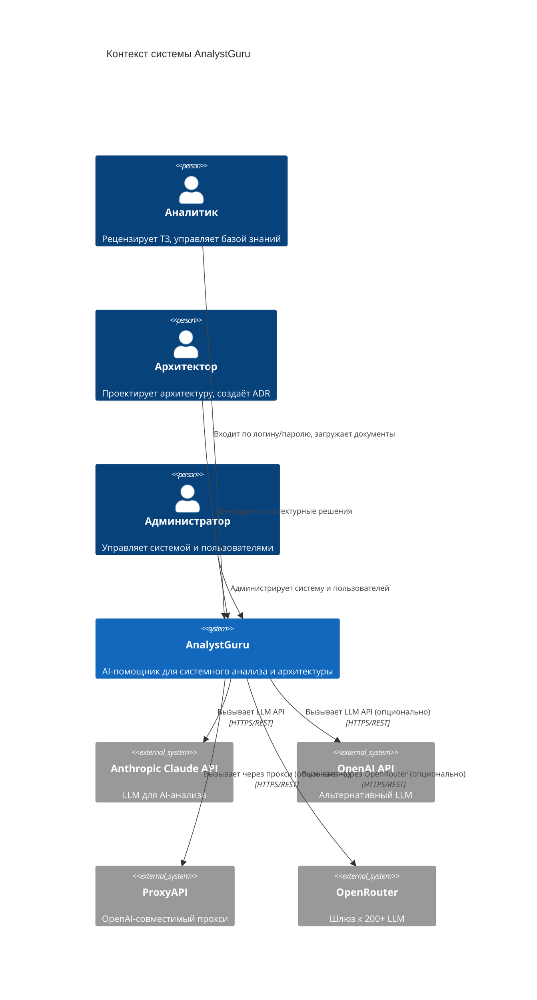
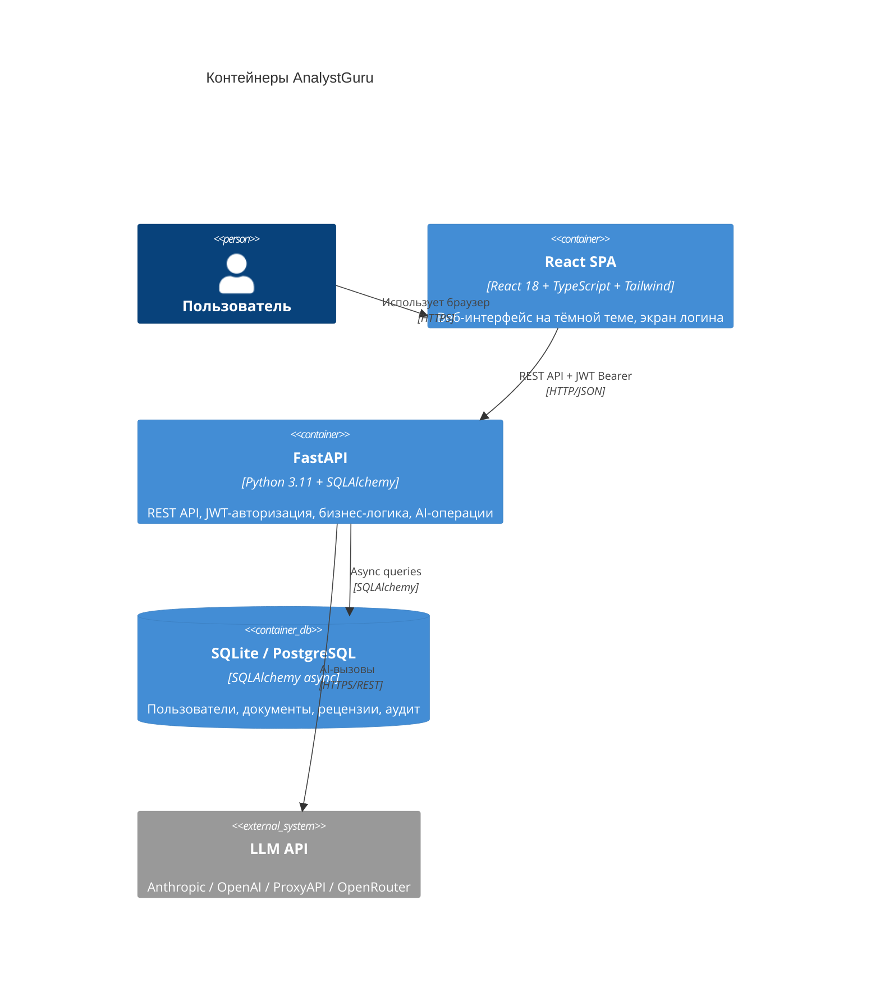
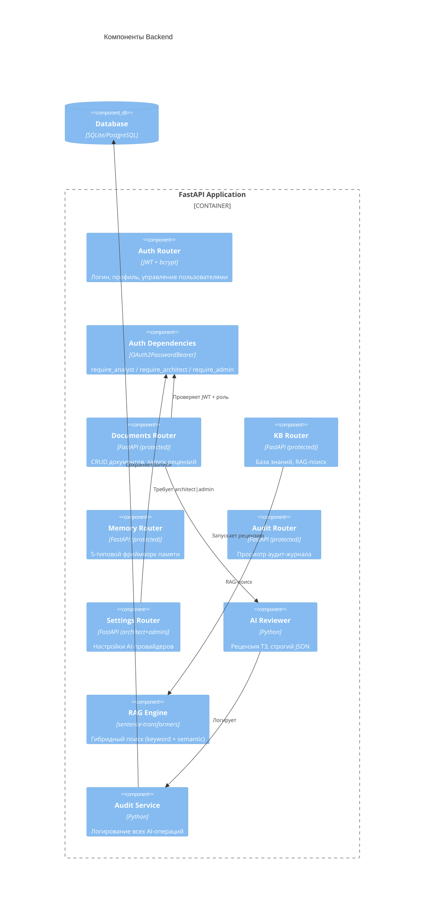
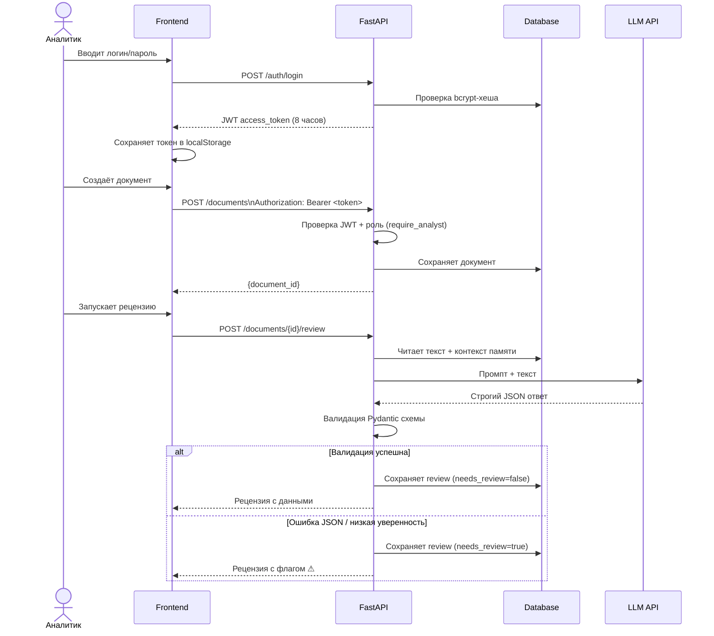
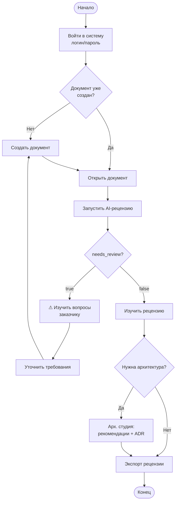
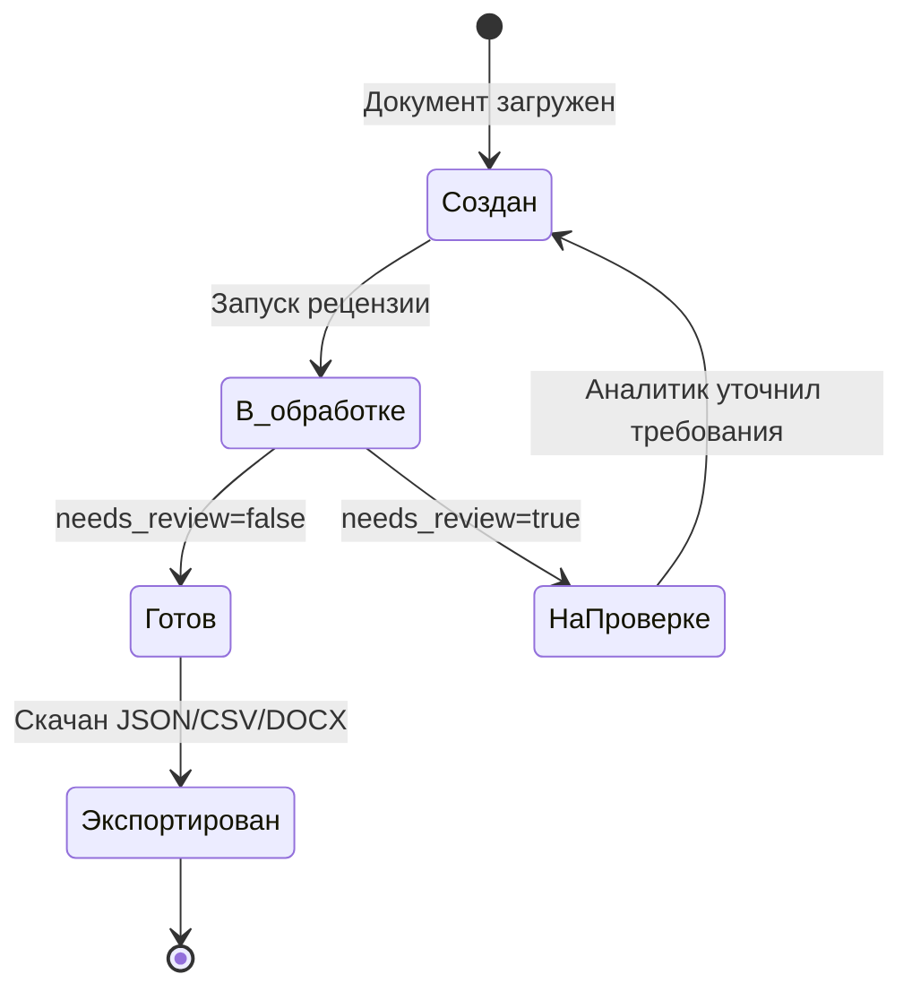
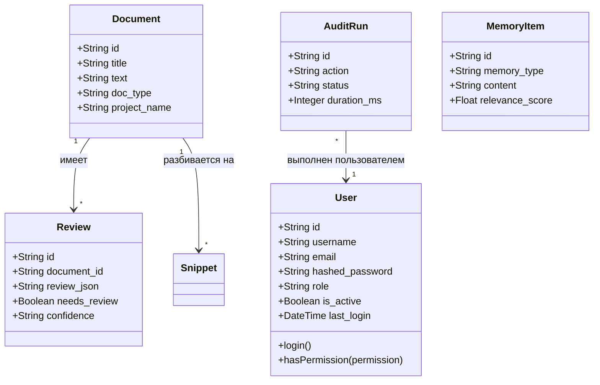

# Руководство пользователя AnalystGuru

> **AnalystGuru** — AI-помощник для системных аналитиков и архитекторов.  
> Версия: 1.0.0 | Языки интерфейса: 🇷🇺 Русский / 🇬🇧 English

---

## Содержание

1. [Введение и роли](#1-введение-и-роли)
2. [Архитектура системы (C4)](#2-архитектура-системы-c4)
3. [Вход в систему](#3-вход-в-систему)
4. [Бизнес-сценарии по ролям](#4-бизнес-сценарии-по-ролям)
5. [Работа с документами](#5-работа-с-документами)
6. [AI-рецензия документа](#6-ai-рецензия-документа)
7. [Архитектурная студия](#7-архитектурная-студия)
8. [База знаний (RAG)](#8-база-знаний-rag)
9. [Фреймворк памяти](#9-фреймворк-памяти)
10. [Аудит-центр](#11-аудит-центр)
11. [Экономика проектов — ROI и окупаемость](#12-экономика-проектов--roi-и-окупаемость)
12. [Экспорт бизнес-кейса](#13-экспорт-бизнес-кейса)
13. [UML-диаграммы рабочих процессов](#14-uml-диаграммы-рабочих-процессов)

---

## 1. Введение и роли

### Для кого этот продукт

AnalystGuru решает проблему **дорогостоящего ручного анализа** технических заданий и архитектурных решений. Без системы аналитик тратит 2–4 часа на рецензию одного ТЗ; с AnalystGuru — 5–10 минут.

### Роли пользователей

Доступ к системе строится на **обязательной авторизации по логину и паролю** (JWT-токен, срок жизни 8 часов). Каждому пользователю назначается одна из трёх ролей:

| Роль | Описание | Возможности |
|------|----------|-------------|
| **Аналитик** (`analyst`) | Специалист по требованиям | Создание и рецензия документов, работа с базой знаний, управление памятью, просмотр аудита |
| **Архитектор** (`architect`) | Архитектор ПО | Всё что аналитик + настройки AI-провайдеров, архитектурные рекомендации, генерация ADR |
| **Администратор** (`admin`) | Системный администратор | Полный доступ + управление пользователями (создание, роли, блокировка, сброс паролей) |

### Матрица доступа

| Функция | Аналитик | Архитектор | Администратор |
|---------|:---:|:---:|:---:|
| Вход по логину/паролю | ✅ | ✅ | ✅ |
| Создание документов | ✅ | ✅ | ✅ |
| AI-рецензия | ✅ | ✅ | ✅ |
| Архитектурные рекомендации | ✅ | ✅ | ✅ |
| Генерация ADR | ✅ | ✅ | ✅ |
| База знаний / RAG | ✅ | ✅ | ✅ |
| Просмотр аудита | ✅ | ✅ | ✅ |
| Настройки AI-провайдеров | ❌ (403) | ✅ | ✅ |
| Управление пользователями | ❌ (403) | ❌ (403) | ✅ |

> Все ограничения проверяются **на backend** (JWT + роль), а не только скрываются в интерфейсе — попытка вызвать защищённый эндпоинт без нужной роли вернёт HTTP 403.

---

## 2. Архитектура системы (C4)

### C4 Level 1 — Контекст системы



### C4 Level 2 — Контейнеры



### C4 Level 3 — Компоненты Backend



---

## 3. Вход в систему

### Шаги авторизации

1. Откройте браузер и перейдите по адресу `http://localhost:3000`
2. Система показывает экран **входа** (без авторизации приложение недоступно)
3. Введите **логин** и **пароль**
4. Нажмите кнопку **→ Войти**

После успешного входа backend выдаёт **JWT-токен** (действует 8 часов), который сохраняется в браузере и автоматически прикладывается ко всем запросам. Вы попадёте на главную страницу — список документов.

### Тестовые учётные записи

| Логин | Пароль | Роль |
|-------|--------|------|
| `admin` | `admin123` | Администратор |
| `analyst` | `analyst123` | Аналитик |
| `architect` | `architect123` | Архитектор |

На экране входа есть кнопки быстрого заполнения для каждой из трёх ролей — удобно для демонстрации.

> ⚠️ Смените пароли по умолчанию перед переводом в продакшн!

### Что происходит при неверном пароле

Backend возвращает `401 Unauthorized`, интерфейс показывает сообщение "Неверный логин или пароль" без уточнения, что именно неверно (логин или пароль) — это стандартная практика безопасности.

### Выход из системы

Кнопка **⎋** рядом с именем пользователя в боковом меню — удаляет токен из браузера и возвращает на экран входа.

### Переключение языка

Кнопка 🇬🇧 EN / 🇷🇺 RU находится:
- **На странице входа** — правый верхний угол
- **В боковом меню** — нижняя часть sidebar

Выбор языка сохраняется в браузере независимо от сессии авторизации.

---

## 4. Бизнес-сценарии по ролям

### Сценарий А: Аналитик рецензирует техническое задание

**Участник:** Аналитик (роль `analyst`)  
**Цель:** Получить структурированную рецензию ТЗ за 5 минут вместо 2 часов

```
Шаг 0: Вход в систему — analyst / analyst123
Шаг 1: Аналитик → [Документы] → [+ Новый документ]
Шаг 2: Заполняет поля: название, тип = ТЗ, проект, текст
Шаг 3: Нажимает [🔍 Рецензия] в списке документов
Шаг 4: AI анализирует документ (15–45 сек)
Шаг 5: Аналитик изучает:
        - Резюме документа
        - Риски (высокий / средний / низкий)
        - Вопросы заказчику
        - Критерии приёмки
Шаг 6: Если needs_review=true — ⚠️ требует ручной проверки
Шаг 7: Экспорт рецензии в JSON / CSV / DOCX
```

### Сценарий Б: Архитектор создаёт архитектурное решение

**Участник:** Архитектор (роль `architect`)  
**Цель:** Выбрать архитектурный паттерн, задокументировать в ADR, настроить AI-провайдера

```
Шаг 0: Вход в систему — architect / architect123
Шаг 1: Архитектор → [Арх. студия]
Шаг 2: Выбирает документ (ТЗ) из списка
Шаг 3: Нажимает [🏛 Рекомендовать архитектуру]
        → Получает: паттерн + обоснование + альтернативы + риски
Шаг 4: Нажимает [📋 Создать ADR]
        → Получает: ADR с контекстом, решением, последствиями
Шаг 5: Нажимает [🔌 Создать API Spec] → OpenAPI 3.1 (JSON + YAML)
Шаг 6: Нажимает [🗺 Сгенерировать диаграммы] → C4, UML, ERD, Mermaid

Настройка AI-провайдера (доступно только architect/admin):
Шаг 7: Архитектор → [⚙️ Настройки]
Шаг 8: Выбирает провайдер, вводит API ключ, тестирует связь
Шаг 9: Для OpenRouter можно выбрать Route (режим маршрутизации):
      • `openrouter/free` — только бесплатные модели (по умолчанию)
      • `openrouter/fusion` — ансамбль из 2+ моделей, возвращает лучший результат
      • `openrouter/pareto-code` — оптимизация для задач программирования
Шаг 10: Настраивает модель, температуру, макс. токенов (для всех провайдеров)
Шаг 11: Активирует провайдер для всей команды
```

### Сценарий В: Аналитик работает с базой знаний команды

**Участник:** Аналитик  
**Цель:** Быстро найти ответ во внутренних документах

```
Шаг 1: Аналитик → [База знаний] → [📚 Документы]
Шаг 2: Добавляет внутренние документы (правила, стандарты, FAQ)
Шаг 3: Переходит на вкладку [💬 Задать вопрос]
Шаг 4: Вводит вопрос на естественном языке
Шаг 5: Система ищет в базе знаний и формирует ответ с цитатами
Шаг 6: Если needs_review=true — база знаний не содержит ответа
```

### Сценарий Г: Администратор управляет командой

**Участник:** Администратор (роль `admin`)  
**Цель:** Добавить нового сотрудника, назначить роль, при необходимости заблокировать

```
Шаг 0: Вход в систему — admin / admin123
Шаг 1: Администратор → [👥 Пользователи] → [+ Добавить]
Шаг 2: Заполняет: логин, email, пароль, имя, роль (analyst/architect/admin)
Шаг 3: Новый пользователь может войти с указанными данными
Шаг 4: При необходимости: изменить роль (dropdown в таблице),
        сбросить пароль (🔑), заблокировать/разблокировать (🚫/✓)
```

---

## 5. Настройка AI-провайдеров

### Поддерживаемые провайдеры

| Провайдер | Тип API | Base URL по умолчанию | Особенности |
|-----------|---------|----------------------|-------------|
| **Anthropic Claude** | Native | — | Claude 3.5 Sonnet, Claude 3 Opus |
| **OpenAI GPT** | OpenAI-compat | `https://api.openai.com/v1` | GPT-4o, GPT-4o-mini |
| **ProxyAPI** | OpenAI-compat | `https://api.proxyapi.ru/anthropic` | Доступ к Claude через РФ-прокси |
| **OpenRouter** | OpenAI-compat | `https://openrouter.ai/api/v1` | Шлюз к 200+ моделям |

### OpenRouter Route

OpenRouter поддерживает три режима маршрутизации (выбираются в интерфейсе Настроек):

| Route | Описание |
|-------|----------|
| `openrouter/free` | Только бесплатные модели (лимит: 20 req/min) |
| `openrouter/fusion` | Запрос отправляется на 2+ модели, возвращается лучший ответ |
| `openrouter/pareto-code` | Оптимизирован для генерации и анализа кода |

Route передаётся HTTP-заголовком `X-Route` в каждом запросе к OpenRouter API.

### Параметры модели (для всех провайдеров)

- **Модель** — строковое наименование (выпадающий список + ручной ввод)
- **Температура** — слайдер 0.0–2.0 (0 — детерминированно, 2 — максимально творчески)
- **Макс. токенов** — выбор из предустановленных значений (256–32768)

---

## 6. Работа с документами

### Загрузка Markdown с диаграммами

На странице **Документы** есть кнопка **📄 Загрузить .md**. При загрузке файла `.md` система:

1. Сохраняет документ как `doc_type = markdown`
2. Автоматически извлекает блоки ` ```mermaid ` и ` ```plantuml ` / `@startuml...@enduml` и сохраняет их как отдельные артефакты диаграмм
3. На странице просмотра документа markdown-контент отображается с рендерингом диаграмм:
   - **Mermaid** — рендеринг через браузерную библиотеку mermaid.js
   - **PlantUML** — отображение через сервис plantuml.com (SVG-изображение)

### Создание итогового документа

На странице детального просмотра документа доступна кнопка **📄 Итоговый MD**, которая генерирует консолидированный markdown-файл, включающий:

- Исходный текст документа
- Последнюю AI-рецензию (summary, риски)
- ADR (если есть)
- Сгенерированные диаграммы (mermaid / plantuml)

---

### Поддерживаемые типы документов

| Тип | Код | Описание |
|-----|-----|----------|
| Техническое задание | `tz` | Классическое ТЗ на разработку |
| BRD | `brd` | Business Requirements Document |
| User Story | `user_story` | Пользовательские истории |
| SRS | `srs` | Software Requirements Specification |
| KB Article | `kb_article` | Статья базы знаний (индексируется для RAG) |

### Создание документа

1. Перейдите в **Документы**
2. Нажмите **+ Новый документ**
3. Заполните поля: **Название**, **Тип**, **Проект** (опционально), **Текст** (до 30 000 символов)
4. Нажмите **✓ Создать**

### Детальная страница документа

Нажмите на документ в списке, чтобы открыть детальную страницу со вкладками: **📄 Текст**, **🔍 Рецензия**, **🏛 Архитектура**, **📋 ADR**, **🔌 API**, **🗺 Диаграммы**, **📝 Спецификации**.

---

## 7. AI-рецензия документа

### Что анализирует AI

| Раздел | Описание |
|--------|----------|
| **Резюме** | 2–6 предложений о документе |
| **Риски** | Список с метками: ВЫСОКИЙ / СРЕДНИЙ / НИЗКИЙ |
| **Вопросы заказчику** | Список вопросов для снятия неопределённости |
| **Критерии приёмки** | Проверяемые условия завершения работы |
| **Отсутствующие требования** | Что не хватает для начала разработки |
| **Архитектурные риски** | Технические риски реализации |
| **Уверенность** | Высокая / Средняя / Низкая |

### Режимы рассуждения (Reasoning)

Перед запуском рецензии на детальной странице документа можно выбрать один из трёх режимов:

| Режим | Обозначение | Описание |
|-------|------------|----------|
| **Direct** | По умолчанию | Модель сразу возвращает JSON-рецензию. Самый быстрый и дешёвый режим. |
| **CoT** | 🧠 CoT | Chain-of-Thought — модель сначала расписывает ход рассуждений по шагам (в блоке `<thinking>`), затем выдаёт JSON. Повышает качество на сложных/противоречивых документах. |
| **ReAct** | 🔄 ReAct | Reasoning + Acting — модель чередует Thought/Action/Observation (в блоке `<reasoning>`), имитируя итеративный анализ. Полезен для многоаспектных документов. |

После выбора режима нажмите **🔍 Рецензия** — блоки рассуждений будут автоматически отфильтрованы из финального ответа.

### Авто-сохранение в память проекта

После успешной рецензии система автоматически извлекает из результата:
- **Риски** (в т.ч. архитектурные) → сохраняются как `MemoryItem` с типом `risk`
- **Отсутствующие требования** → сохраняются как `requirement`
- **Принятые решения** → сохраняются как `decision`
- **Уроки проектов** → сохраняются как `episodic`

Все эти данные привязываются к проекту (если он указан в документе) и становятся доступны для **контекста будущих генераций**. Эмбеддинги сохраняются в FAISS-индекс для быстрого семантического поиска.

### Флаг ⚠ Требует проверки

Флаг `needs_review = true` устанавливается если: документ слишком краткий (< 8 слов), обнаружены противоречивые требования, уверенность AI низкая, или AI вернул некорректный формат JSON.

**Что делать при флаге:** прочитайте вопросы заказчику → уточните требования → создайте новую версию → запустите рецензию повторно.

### Экспорт рецензии

**JSON** (полные данные), **CSV** (Excel, UTF-8 BOM), **DOCX** (форматированный отчёт).

---

## 8. Архитектурная студия

### Контекст проекта в генерациях

Все инструменты архитектурной студии (URS, SRS, ADR, архитектура, API, диаграммы) автоматически получают **контекст проекта**:
- риски, извлечённые из предыдущих рецензий
- архитектурные решения, принятые ранее
- уроки аналогичных проектов

Если документ привязан к проекту (`project_name`), система передаёт эти данные в промпт LLM, что повышает связность документации внутри одного проекта.

### Генерация архитектурных рекомендаций

| Паттерн | Когда подходит |
|---------|---------------|
| Monolith | Небольшая команда, простой домен, MVP |
| Modular Monolith | Средняя команда, умеренная сложность |
| Microservices | Большая команда, высокая нагрузка |
| Event-Driven | Слабая связанность, асинхронные операции |
| CQRS | Разные требования к чтению/записи |
| Serverless | Непредсказуемая нагрузка, низкий бюджет |
| Hexagonal | Сложный домен, тестируемость |

### Диаграммы

**PlantUML** → [plantuml.com](https://plantuml.com) или IDE-плагин. **Mermaid** → [mermaid.live](https://mermaid.live).

---

## 9. База знаний (RAG)

```
Документы → Разбивка на фрагменты → Векторизация
                                            ↓
Вопрос → Keyword search + Semantic search → Top-K фрагментов
                                            ↓
                              LLM формирует ответ с цитатами
```

Если в базе знаний нет ответа → `needs_review = true`, ответ "Данных недостаточно". Все ответы сопровождаются цитатами-источниками.

---

## 10. Фреймворк памяти

| Тип | Назначение | Пример |
|-----|-----------|--------|
| 🔷 Семантическая | Концепции и стандарты | "В команде используем CQRS для высоконагруженных сервисов" |
| 📅 Эпизодическая | Уроки проектов | "Проект X: недооценили интеграцию с SAP — +3 недели" |
| ⚖️ Решения | Принятые решения | "Выбрали Kafka вместо RabbitMQ для хранения истории" |
| ⚠️ Риски | Типовые риски | "Интеграция с legacy — всегда +30% к оценке" |
| 📋 Требования | Извлечённые требования | "Клиент требует GDPR для EU рынка" |

### Механизм поиска

Каждый элемент памяти хранится с векторным эмбеддингом (модель `all-MiniLM-L6-v2`, 384-мерный вектор). Поиск использует **FAISS-индекс** (IndexFlatIP — косинусная близость) для быстрого семантического поиска. При недоступности FAISS используется гибридный скоринг: 40% keyword (Jaccard-пересечение) + 60% косинусная близость.

### Автоматическое пополнение

При запуске AI-рецензии документа система автоматически сохраняет найденные риски, требования, решения и уроки в память проекта. Это означает, что каждый новый документ в проекте видит контекст предыдущих рецензий.

### Применение

Элементы памяти автоматически учитываются при AI-рецензии и генерации документации: типовые риски, уроки проектов и решения обогащают промпт всех инструментов архитектурной студии (URS, SRS, ADR, архитектура, API, диаграммы).

---

## 11. Аудит-центр

Каждая AI-операция логируется: время выполнения, входные данные, результат, статус (✓ OK / ⚠ Требует проверки / ✗ Ошибка). На странице отображается статистика: процент успешных/требующих проверки/ошибочных операций, среднее время ответа AI.

---

## 12. Экономика проектов — ROI и окупаемость

**Где:** Боковое меню → 💰 Экономика

Экономический модуль автоматизирует расчёт стоимости разработки, окупаемости и ROI.

### Жизненный цикл

1. **Создание проекта** — привяжите документ (ТЗ/BRD/SRS) к build-проекту
2. **AI-декомпозиция задач** — AI разбивает требования на задачи по ролям (backend, frontend, QA, DevOps, Analyst) с оценкой часов
3. **Расчёт экономики** — введите ставки через слайдеры (живой предпросмотр ROI) → "Сохранить в БД"
4. **План/факт** — после внедрения введите фактические затраты

### Слайдеры с живым предпросмотром

В разделе "Economics" доступны слайдеры для каждой роли. При изменении любого слайдера CAPEX, ROI и срок окупаемости пересчитываются мгновенно на клиенте.

### График безубыточности

После расчёта отображается столбчатая диаграмма Cumulative Cost vs Cumulative Benefit на 12 месяцев. Точка пересечения = break-even.

### Формулы

```
CAPEX = Σ(часы × ставка)
OPEX/мес = хостинг + LLM + поддержка
Выгода/мес = часы_экономии × ставка
Окупаемость = CAPEX / (Выгода − OPEX)
ROI_12мес = ((Выгода − OPEX) × 12 − CAPEX) / CAPEX × 100
```

---

## 13. Экспорт бизнес-кейса

Из карточки проекта: кнопки ⬇ DOCX (Word) и ⬇ PDF — с CAPEX, OPEX, ROI и декомпозицией задач.

---

## 14. UML-диаграммы рабочих процессов

### Sequence Diagram: Авторизация + AI-рецензия документа



### Activity Diagram: Рабочий процесс аналитика



### State Diagram: Жизненный цикл рецензии



### Class Diagram: Доменная модель (включая пользователей)


