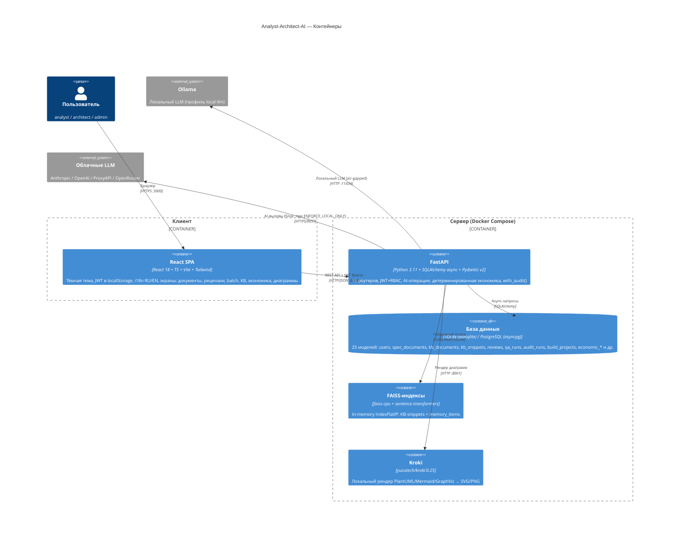
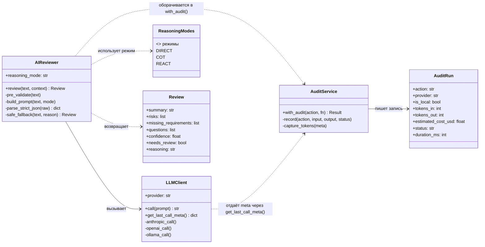
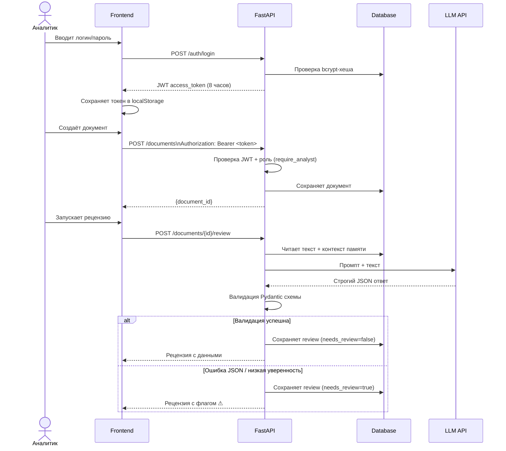
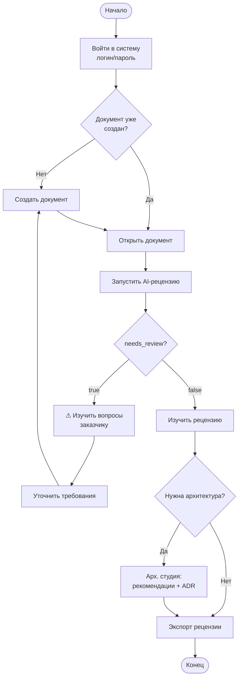
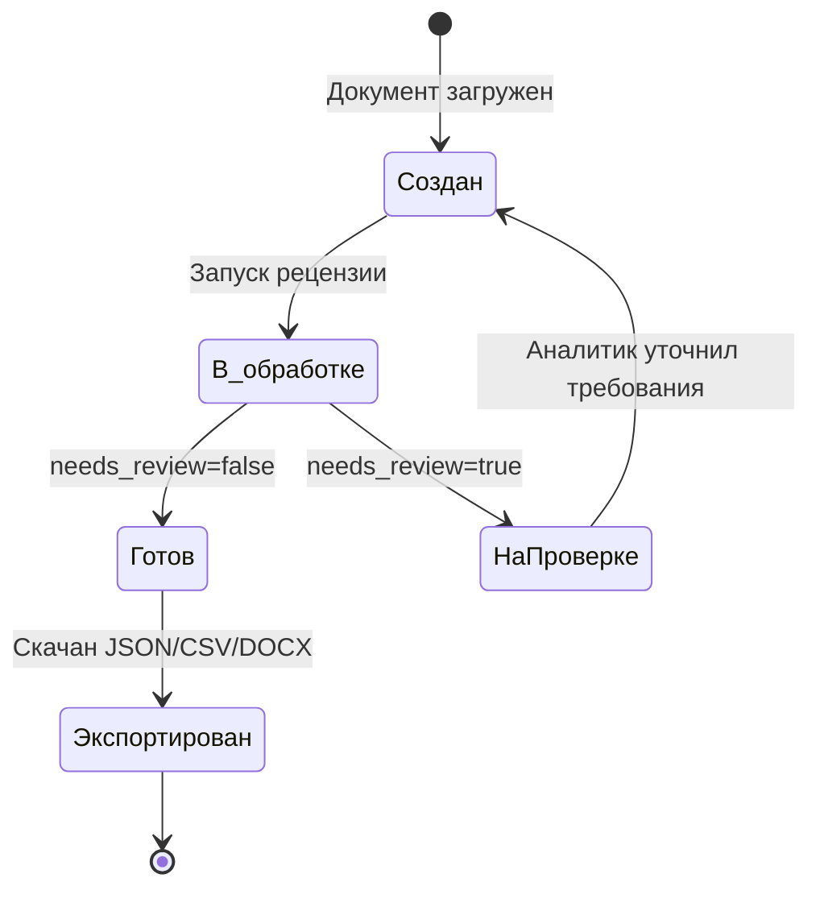
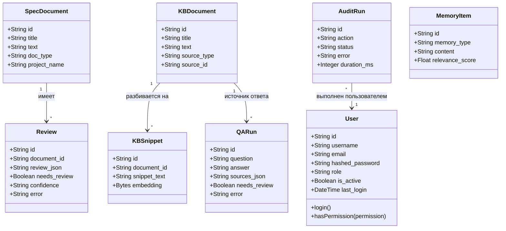

# Руководство пользователя Analyst-Architect-AI

> **Analyst-Architect-AI** — AI-копилот системного аналитика и архитектора решений.
> Версия: 1.0.0 | Языки интерфейса: 🇷🇺 Русский / 🇬🇧 English | 15 экранов, 15 API-роутеров, 25 моделей

---

## Содержание

1. [Введение и роли](#1-введение-и-роли)
2. [Архитектура системы (C4)](#2-архитектура-системы-c4)
3. [Вход в систему](#3-вход-в-систему)
4. [Бизнес-сценарии по ролям](#4-бизнес-сценарии-по-ролям)
5. [Настройка AI-провайдеров](#5-настройка-ai-провайдеров)
6. [Работа с документами](#6-работа-с-документами)
7. [AI-рецензия документа](#7-ai-рецензия-документа)
8. [Архитектурная студия](#8-архитектурная-студия)
9. [База знаний (RAG)](#9-база-знаний-rag)
10. [Фреймворк памяти](#10-фреймворк-памяти)
11. [Аудит-центр](#11-аудит-центр)
12. [Экономика проектов — ROI и окупаемость](#12-экономика-проектов--roi-и-окупаемость)
13. [Экспорт бизнес-кейса](#13-экспорт-бизнес-кейса)
14. [Дополнительные модули: Batch, Risk Catalog, Lessons, Dashboard, Settings, Users, Standards](#14-дополнительные-модули-batch-risk-catalog-lessons-dashboard-settings-users-standards)
15. [UML-диаграммы рабочих процессов](#15-uml-диаграммы-рабочих-процессов)

---

## 1. Введение и роли

### Для кого этот продукт

Analyst-Architect-AI решает проблему **дорогостоящего ручного анализа** технических заданий и архитектурных решений. Без системы аналитик тратит 2–4 часа на рецензию одного ТЗ; с Analyst-Architect-AI — 5–10 минут. Система объединяет AI-рецензию, генерацию URS/SRS/ADR/API, диаграммы, базу знаний (RAG), фреймворк памяти и **модуль экономики** для расчёта CAPEX/OPEX/ROI по каждому build-проекту.

### Главная страница: обзор экранов

После входа в боковом меню доступны 15 экранов:

| # | Раздел | Назначение |
|---|--------|------------|
| 1 | 📊 **Dashboard** | Сводная статистика: документы, рецензии, AI-операции, провайдер, факт. расход LLM |
| 2 | 📄 **Документы** | Список ТЗ/BRD/SRS/User Story, загрузка .md, рецензия, экспорт |
| 3 | 🔍 **Рецензии** | Список AI-рецензий, сравнение двух рецензий (diff), экспорт JSON/CSV |
| 4 | 📦 **Batch-рецензии** | Пакетная рецензия до 50 ТЗ за один запрос |
| 5 | 🏛 **Арх. студия** | Рекомендации архитектуры, ADR, OpenAPI, C4/UML/ERD, версионирование |
| 6 | 📚 **База знаний** | Внутренние KB-статьи, семантический вопрос-ответ с цитатами |
| 7 | 🧠 **Память** | 5-типовой фреймворк: семантика / эпизоды / решения / риски / требования |
| 8 | 🛡 **Аудит** | Журнал всех AI-операций с метриками ok / needs_review / error |
| 9 | ⚠️ **Risk Catalog** | Каталог типовых рисков с категориями и экспортом CSV |
| 10 | 📘 **Уроки** | Уроки проектов (положительные и отрицательные) |
| 11 | 💰 **Экономика** | Build-проекты: AI-декомпозиция, CAPEX/OPEX/ROI, план/факт, DOCX/PDF |
| 12 | ⚙️ **Настройки** | AI-провайдеры (Anthropic / OpenAI / ProxyAPI / OpenRouter / Ollama) |
| 13 | 👥 **Пользователи** | Управление командой (только admin) |

### Роли пользователей

Доступ к системе строится на **обязательной авторизации по логину и паролю** (JWT-токен, срок жизни 8 часов). Каждому пользователю назначается одна из трёх ролей:

| Роль | Описание | Возможности |
|------|----------|-------------|
| **Аналитик** (`analyst`) | Специалист по требованиям | Документы, рецензии, batch-рецензии, KB, память, диаграммы, аудит, стандарты, risk-catalog, lessons, **build-проекты и экономика** |
| **Архитектор** (`architect`) | Архитектор ПО | Всё что аналитик + **настройки AI-провайдеров** (включая Ollama), внесение факта в build-проекты |
| **Администратор** (`admin`) | Системный администратор | Всё + **управление пользователями** (создание, роли, блокировка, сброс паролей) + **seed-данные** |

### Матрица доступа

| Функция | Аналитик | Архитектор | Администратор |
|---------|:---:|:---:|:---:|
| Вход по логину/паролю | ✅ | ✅ | ✅ |
| Создание / рецензия документов | ✅ | ✅ | ✅ |
| Batch-рецензии (до 50 ТЗ) | ✅ | ✅ | ✅ |
| AI-рецензия (CoT / ReAct) | ✅ | ✅ | ✅ |
| Архитектурные рекомендации, ADR, OpenAPI | ✅ | ✅ | ✅ |
| C4 / UML / ERD + версионирование | ✅ | ✅ | ✅ |
| База знаний / RAG | ✅ | ✅ | ✅ |
| Память (5 типов) | ✅ | ✅ | ✅ |
| Стандарты (ГОСТ 34 / ISO 29148 / IEEE 830) | ✅ | ✅ | ✅ |
| Risk Catalog / Уроки проектов | ✅ | ✅ | ✅ |
| **Build-проекты и экономика (CAPEX/OPEX/ROI)** | ✅ | ✅ | ✅ |
| Внесение факта (actuals) в build-проект | ❌ (403) | ✅ | ✅ |
| Просмотр аудита | ✅ | ✅ | ✅ |
| **Настройки AI-провайдеров** | ❌ (403) | ✅ | ✅ |
| **Управление пользователями** | ❌ (403) | ❌ (403) | ✅ |
| **Seed демо-данных (`/seed/...`)** | ❌ (403) | ❌ (403) | ✅ |

> Все ограничения проверяются **на backend** (JWT + роль) через `require_admin` / `require_architect` / `require_analyst` в `app/main.py`, а не только скрываются в интерфейсе — попытка вызвать защищённый эндпоинт без нужной роли вернёт HTTP 403.

---

## 2. Архитектура системы (C4)

### C4 Level 1 — Контекст системы

```mermaid
C4Context
    title Analyst-Architect-AI — Контекст системы

    Person(analyst, "Аналитик", "Рецензирует ТЗ, генерирует URS/SRS/ADR, считает экономику")
    Person(architect, "Архитектор", "Проектирует архитектуру, настраивает AI-провайдеры")
    Person(admin, "Администратор", "Управляет пользователями и демо-данными")

    System(ag, "Analyst-Architect-AI", "AI-копилот для системного аналитика и архитектора")

    System_Ext(claude, "Anthropic Claude", "LLM по умолчанию (claude-sonnet-4)")
    System_Ext(openai, "OpenAI", "gpt-4o")
    System_Ext(proxyapi, "ProxyAPI", "OpenAI-совместимый RU-прокси")
    System_Ext(openrouter, "OpenRouter", "Шлюз к 200+ моделям")
    System_Ext(ollama, "Ollama", "Локальный LLM (air-gapped, qwen2.5)")
    System_Ext(kroki, "Kroki", "Локальный рендер PlantUML/Mermaid → SVG/PNG")

    Rel(analyst, ag, "Работает с документами, рецензиями, экономикой")
    Rel(architect, ag, "Архитектура, диаграммы, настройки LLM")
    Rel(admin, ag, "Пользователи, seed-данные")
    Rel(ag, claude, "Вызывает LLM API", "HTTPS/REST")
    Rel(ag, openai, "Вызывает LLM API (опционально)", "HTTPS/REST")
    Rel(ag, proxyapi, "RU-прокси (опционально)", "HTTPS/REST")
    Rel(ag, openrouter, "Шлюз (опционально)", "HTTPS/REST")
    Rel(ag, ollama, "Локальный LLM (без выхода в интернет)", "HTTP :11434")
    Rel(ag, kroki, "Рендер диаграмм (без выхода в интернет)", "HTTP :8001")

    UpdateRelConfig(ag, claude, "При ENFORCE_LOCAL_ONLY=true — заблокирован")
    UpdateRelConfig(ag, openai, "При ENFORCE_LOCAL_ONLY=true — заблокирован")
```

### C4 Level 2 — Контейнеры



### C4 Level 3 — Компоненты Backend

```mermaid
C4Component
    title Компоненты Backend (FastAPI)

    Container_Boundary(api, "FastAPI Application") {
        Component(auth_r, "Auth Router", "JWT + bcrypt", "Логин, профиль, управление пользователями")
        Component(deps, "Auth Dependencies", "OAuth2PasswordBearer", "require_analyst / require_architect / require_admin")

        Component(docs_r, "Documents Router", "FastAPI", "CRUD документов, URS/SRS/ADR/API, рецензии, экспорт")
        Component(batch_r, "Batch Reviews Router", "FastAPI", "Пакетная рецензия до 50 ТЗ")
        Component(kb_r, "KB Router", "FastAPI", "База знаний, RAG-поиск, автоиндексация")
        Component(mem_r, "Memory Router", "FastAPI", "5-типовой фреймворк памяти")
        Component(diag_r, "Diagrams Router", "FastAPI", "C4/UML/ERD, версионирование + rollback")
        Component(std_r, "Standards Router", "FastAPI", "ГОСТ 34 / ISO 29148 / IEEE 830")
        Component(risk_r, "Risk Catalog Router", "FastAPI", "CRUD рисков")
        Component(less_r, "Lessons Router", "FastAPI", "Уроки проектов")
        Component(econ_r, "Build Projects Router", "FastAPI", "Экономика: CAPEX/OPEX/ROI")
        Component(dash_r, "Dashboard Router", "FastAPI", "Статистика, actual-usage")
        Component(audit_r, "Audit Router", "FastAPI", "Просмотр аудит-журнала")
        Component(settings_r, "Settings Router", "FastAPI (architect+admin)", "Настройки 5 AI-провайдеров")

        Component(ai_rev, "AI Reviewer", "Python", "Рецензия ТЗ, reasoning modes (direct/cot/react), safe_fallback")
        Component(rag, "RAG Engine", "sentence-transformers + FAISS", "Гибридный поиск (keyword 40% + semantic 60%)")
        Component(diag_eng, "Diagram Engine", "Python", "Генерация + Kroki-рендер, версионирование")
        Component(econ_svc, "Economics Service", "Python", "CAPEX/OPEX/ROI/payback — детерминированно")
        Component(task_est, "Task Estimator", "Python + LLM", "AI-декомпозиция требований в часы по ролям")
        Component(audit_svc, "Audit Service", "Python", "with_audit(): провенанс всех AI-операций")
    }

    ComponentDb(db, "База данных", "SQLite/PostgreSQL")
    ComponentQueue(faiss_q, "FAISS", "in-memory", "IndexFlatIP для KB + memory")

    Rel(docs_r, deps, "Проверка JWT + роль")
    Rel(batch_r, deps, "Проверка JWT + роль")
    Rel(settings_r, deps, "Требует architect|admin")
    Rel(docs_r, ai_rev, "Запуск рецензии")
    Rel(batch_r, ai_rev, "Пакетная рецензия")
    Rel(kb_r, rag, "RAG-поиск")
    Rel(rag, faiss_q, "Semantic-поиск")
    Rel(diag_r, diag_eng, "Генерация + рендер")
    Rel(econ_r, econ_svc, "Расчёт экономики")
    Rel(econ_r, task_est, "Декомпозиция задач")
    Rel(ai_rev, audit_svc, "with_audit()")
    Rel(econ_svc, audit_svc, "Факт LLM-расходов")
    Rel(audit_svc, db, "Сохраняет audit_runs")
```



### C4 Level 4 — Code: AI Reviewer + Audit (ядро системы)



> **Почему этот уровень**: AI Reviewer — ядро продукта. Диаграмма показывает три reasoning-режима (direct/cot/react), обязательное оборачивание каждого LLM-вызова в `with_audit()` (провенанс + учёт токенов/стоимости), и `safe_fallback()` — гарантированная рецензия даже при сбое LLM. `is_local` в `AuditRun` доказывает (для compliance), покинули ли данные корпоративный периметр.

---

## 3. Вход в систему

### Шаги авторизации

1. Откройте браузер и перейдите по адресу `http://localhost:3000`
2. Система показывает экран **входа** (без авторизации приложение недоступно)
3. Введите **логин** и **пароль**
4. Нажмите кнопку **→ Войти**

После успешного входа backend выдаёт **JWT-токен** (действует 8 часов), который сохраняется в браузере и автоматически прикладывается ко всем запросам. Вы попадёте на главную страницу — список документов.

### Тестовые учётные записи

| Логин | Пароль | Роль |
|-------|--------|------|
| `admin` | `admin123` | Администратор |
| `analyst` | `analyst123` | Аналитик |
| `architect` | `architect123` | Архитектор |

На экране входа есть кнопки быстрого заполнения для каждой из трёх ролей — удобно для демонстрации.

> ⚠️ Смените пароли по умолчанию перед переводом в продакшн!

### Что происходит при неверном пароле

Backend возвращает `401 Unauthorized`, интерфейс показывает сообщение "Неверный логин или пароль" без уточнения, что именно неверно (логин или пароль) — это стандартная практика безопасности.

### Выход из системы

Кнопка **⎋** рядом с именем пользователя в боковом меню — удаляет токен из браузера и возвращает на экран входа.

### Переключение языка

Кнопка 🇬🇧 EN / 🇷🇺 RU находится:
- **На странице входа** — правый верхний угол
- **В боковом меню** — нижняя часть sidebar

Выбор языка сохраняется в браузере независимо от сессии авторизации.

---

## 4. Бизнес-сценарии по ролям

### Сценарий А: Аналитик рецензирует техническое задание

**Участник:** Аналитик (роль `analyst`)  
**Цель:** Получить структурированную рецензию ТЗ за 5 минут вместо 2 часов

```
Шаг 0: Вход в систему — analyst / analyst123
Шаг 1: Аналитик → [Документы] → [+ Новый документ]
Шаг 2: Заполняет поля: название, тип = ТЗ, проект, текст
Шаг 3: Нажимает [🔍 Рецензия] в списке документов
Шаг 4: AI анализирует документ (15–45 сек)
Шаг 5: Аналитик изучает:
        - Резюме документа
        - Риски (высокий / средний / низкий)
        - Вопросы заказчику
        - Критерии приёмки
Шаг 6: Если needs_review=true — ⚠️ требует ручной проверки
Шаг 7: Экспорт рецензии в JSON / CSV / DOCX
```

### Сценарий Б: Архитектор создаёт архитектурное решение

**Участник:** Архитектор (роль `architect`)  
**Цель:** Выбрать архитектурный паттерн, задокументировать в ADR, настроить AI-провайдера

```
Шаг 0: Вход в систему — architect / architect123
Шаг 1: Архитектор → [Арх. студия]
Шаг 2: Выбирает документ (ТЗ) из списка
Шаг 3: Нажимает [🏛 Рекомендовать архитектуру]
        → Получает: паттерн + обоснование + альтернативы + риски
Шаг 4: Нажимает [📋 Создать ADR]
        → Получает: ADR с контекстом, решением, последствиями
Шаг 5: Нажимает [🔌 Создать API Spec] → OpenAPI 3.1 (JSON + YAML)
Шаг 6: Нажимает [🗺 Сгенерировать диаграммы] → C4, UML, ERD, Mermaid

Настройка AI-провайдера (доступно только architect/admin):
Шаг 7: Архитектор → [⚙️ Настройки]
Шаг 8: Выбирает провайдер, вводит API ключ, тестирует связь
Шаг 9: Для OpenRouter можно выбрать Route (режим маршрутизации):
      • `openrouter/free` — только бесплатные модели (по умолчанию)
      • `openrouter/fusion` — ансамбль из 2+ моделей, возвращает лучший результат
      • `openrouter/pareto-code` — оптимизация для задач программирования
Шаг 10: Настраивает модель, температуру, макс. токенов (для всех провайдеров)
Шаг 11: Активирует провайдер для всей команды
```

### Сценарий В: Аналитик работает с базой знаний команды

**Участник:** Аналитик  
**Цель:** Быстро найти ответ во внутренних документах

```
Шаг 1: Аналитик → [База знаний] → [📚 Документы]
Шаг 2: Добавляет внутренние документы (правила, стандарты, FAQ)
Шаг 3: Переходит на вкладку [💬 Задать вопрос]
Шаг 4: Вводит вопрос на естественном языке
Шаг 5: Система ищет в базе знаний и формирует ответ с цитатами
Шаг 6: Если needs_review=true — база знаний не содержит ответа
```

### Сценарий Г: Администратор управляет командой

**Участник:** Администратор (роль `admin`)  
**Цель:** Добавить нового сотрудника, назначить роль, при необходимости заблокировать

```
Шаг 0: Вход в систему — admin / admin123
Шаг 1: Администратор → [👥 Пользователи] → [+ Добавить]
Шаг 2: Заполняет: логин, email, пароль, имя, роль (analyst/architect/admin)
Шаг 3: Новый пользователь может войти с указанными данными
Шаг 4: При необходимости: изменить роль (dropdown в таблице),
        сбросить пароль (🔑), заблокировать/разблокировать (🚫/✓)
```

---

## 5. Настройка AI-провайдеров

### Поддерживаемые провайдеры

| Провайдер | Тип API | Base URL по умолчанию | Особенности |
|-----------|---------|----------------------|-------------|
| **Anthropic Claude** | Native | — | Claude 3.5 Sonnet, Claude 3 Opus |
| **OpenAI GPT** | OpenAI-compat | `https://api.openai.com/v1` | GPT-4o, GPT-4o-mini |
| **ProxyAPI** | OpenAI-compat | `https://api.proxyapi.ru/anthropic` | Доступ к Claude через РФ-прокси |
| **OpenRouter** | OpenAI-compat | `https://openrouter.ai/api/v1` | Шлюз к 200+ моделям |

### OpenRouter Route

OpenRouter поддерживает три режима маршрутизации (выбираются в интерфейсе Настроек):

| Route | Описание |
|-------|----------|
| `openrouter/free` | Только бесплатные модели (лимит: 20 req/min) |
| `openrouter/fusion` | Запрос отправляется на 2+ модели, возвращается лучший ответ |
| `openrouter/pareto-code` | Оптимизирован для генерации и анализа кода |

Route передаётся HTTP-заголовком `X-Route` в каждом запросе к OpenRouter API.

### Параметры модели (для всех провайдеров)

- **Модель** — строковое наименование (выпадающий список + ручной ввод)
- **Температура** — слайдер 0.0–2.0 (0 — детерминированно, 2 — максимально творчески)
- **Макс. токенов** — выбор из предустановленных значений (256–32768)

---

## 6. Работа с документами

### Загрузка Markdown с диаграммами

На странице **Документы** есть кнопка **📄 Загрузить .md**. При загрузке файла `.md` система:

1. Сохраняет документ как `doc_type = markdown`
2. Автоматически извлекает блоки ` ```mermaid ` и ` ```plantuml ` / `@startuml...@enduml` и сохраняет их как отдельные артефакты диаграмм
3. На странице просмотра документа markdown-контент отображается с рендерингом диаграмм:
   - **Mermaid** — рендеринг через браузерную библиотеку mermaid.js
   - **PlantUML** — отображение через сервис plantuml.com (SVG-изображение)

### Создание итогового документа

На странице детального просмотра документа доступна кнопка **📄 Итоговый MD**, которая генерирует консолидированный markdown-файл, включающий:

- Исходный текст документа
- Последнюю AI-рецензию (summary, риски)
- ADR (если есть)
- Сгенерированные диаграммы (mermaid / plantuml)

---

### Поддерживаемые типы документов

| Тип | Код | Описание |
|-----|-----|----------|
| Техническое задание | `tz` | Классическое ТЗ на разработку |
| BRD | `brd` | Business Requirements Document |
| User Story | `user_story` | Пользовательские истории |
| SRS | `srs` | Software Requirements Specification |
| KB Article | `kb_article` | Статья базы знаний — создаётся отдельно в разделе «База знаний» (`POST /kb/documents`, таблица `kb_documents`); в `/documents` не принимается |

### Создание документа

1. Перейдите в **Документы**
2. Нажмите **+ Новый документ**
3. Заполните поля: **Название**, **Тип**, **Проект** (опционально), **Текст** (до 30 000 символов)
4. Нажмите **✓ Создать**

### Детальная страница документа

Нажмите на документ в списке, чтобы открыть детальную страницу со вкладками: **📄 Текст**, **🔍 Рецензия**, **🏛 Архитектура**, **📋 ADR**, **🔌 API**, **🗺 Диаграммы**, **📝 Спецификации**.

---

## 7. AI-рецензия документа

### Что анализирует AI

| Раздел | Описание |
|--------|----------|
| **Резюме** | 2–6 предложений о документе |
| **Риски** | Список с метками: ВЫСОКИЙ / СРЕДНИЙ / НИЗКИЙ |
| **Вопросы заказчику** | Список вопросов для снятия неопределённости |
| **Критерии приёмки** | Проверяемые условия завершения работы |
| **Отсутствующие требования** | Что не хватает для начала разработки |
| **Архитектурные риски** | Технические риски реализации |
| **Уверенность** | Высокая / Средняя / Низкая |

### Режимы рассуждения (Reasoning)

Перед запуском рецензии на детальной странице документа можно выбрать один из трёх режимов:

| Режим | Обозначение | Описание |
|-------|------------|----------|
| **Direct** | По умолчанию | Модель сразу возвращает JSON-рецензию. Самый быстрый и дешёвый режим. |
| **CoT** | 🧠 CoT | Chain-of-Thought — модель сначала расписывает ход рассуждений по шагам (в блоке `<thinking>`), затем выдаёт JSON. Повышает качество на сложных/противоречивых документах. |
| **ReAct** | 🔄 ReAct | Reasoning + Acting — модель чередует Thought/Action/Observation (в блоке `<reasoning>`), имитируя итеративный анализ. Полезен для многоаспектных документов. |

После выбора режима нажмите **🔍 Рецензия** — блоки рассуждений будут автоматически отфильтрованы из финального ответа.

### Авто-сохранение в память проекта

После успешной рецензии система автоматически извлекает из результата:
- **Риски** (в т.ч. архитектурные) → сохраняются как `MemoryItem` с типом `risk`
- **Отсутствующие требования** → сохраняются как `requirement`
- **Принятые решения** → сохраняются как `decision`
- **Уроки проектов** → сохраняются как `episodic`

Все эти данные привязываются к проекту (если он указан в документе) и становятся доступны для **контекста будущих генераций**. Эмбеддинги сохраняются в FAISS-индекс для быстрого семантического поиска.

### Флаг ⚠ Требует проверки

Флаг `needs_review = true` устанавливается если: документ слишком краткий (< 8 слов), обнаружены противоречивые требования, уверенность AI низкая, или AI вернул некорректный формат JSON.

**Что делать при флаге:** прочитайте вопросы заказчику → уточните требования → создайте новую версию → запустите рецензию повторно.

### Экспорт рецензии

**JSON** (полные данные), **CSV** (Excel, UTF-8 BOM), **DOCX** (форматированный отчёт).

---

## 8. Архитектурная студия

### Контекст проекта в генерациях

Все инструменты архитектурной студии (URS, SRS, ADR, архитектура, API, диаграммы) автоматически получают **контекст проекта**:
- риски, извлечённые из предыдущих рецензий
- архитектурные решения, принятые ранее
- уроки аналогичных проектов

Если документ привязан к проекту (`project_name`), система передаёт эти данные в промпт LLM, что повышает связность документации внутри одного проекта.

### Генерация архитектурных рекомендаций

| Паттерн | Когда подходит |
|---------|---------------|
| Monolith | Небольшая команда, простой домен, MVP |
| Modular Monolith | Средняя команда, умеренная сложность |
| Microservices | Большая команда, высокая нагрузка |
| Event-Driven | Слабая связанность, асинхронные операции |
| CQRS | Разные требования к чтению/записи |
| Serverless | Непредсказуемая нагрузка, низкий бюджет |
| Hexagonal | Сложный домен, тестируемость |

### Диаграммы

**PlantUML** → [plantuml.com](https://plantuml.com) или IDE-плагин. **Mermaid** → [mermaid.live](https://mermaid.live).

---

## 9. База знаний (RAG)

```
Документы → Разбивка на фрагменты → Векторизация
                                            ↓
Вопрос → Keyword search + Semantic search → Top-K фрагментов
                                            ↓
                              LLM формирует ответ с цитатами
```

Если в базе знаний нет ответа → `needs_review = true`, ответ "Данных недостаточно". Все ответы сопровождаются цитатами-источниками.

---

## 10. Фреймворк памяти

| Тип | Назначение | Пример |
|-----|-----------|--------|
| 🔷 Семантическая | Концепции и стандарты | "В команде используем CQRS для высоконагруженных сервисов" |
| 📅 Эпизодическая | Уроки проектов | "Проект X: недооценили интеграцию с SAP — +3 недели" |
| ⚖️ Решения | Принятые решения | "Выбрали Kafka вместо RabbitMQ для хранения истории" |
| ⚠️ Риски | Типовые риски | "Интеграция с legacy — всегда +30% к оценке" |
| 📋 Требования | Извлечённые требования | "Клиент требует GDPR для EU рынка" |

### Механизм поиска

Каждый элемент памяти хранится с векторным эмбеддингом (модель `all-MiniLM-L6-v2`, 384-мерный вектор). Поиск использует **FAISS-индекс** (IndexFlatIP — косинусная близость) для быстрого семантического поиска. При недоступности FAISS используется гибридный скоринг: 40% keyword (Jaccard-пересечение) + 60% косинусная близость.

### Автоматическое пополнение

При запуске AI-рецензии документа система автоматически сохраняет найденные риски, требования, решения и уроки в память проекта. Это означает, что каждый новый документ в проекте видит контекст предыдущих рецензий.

### Применение

Элементы памяти автоматически учитываются при AI-рецензии и генерации документации: типовые риски, уроки проектов и решения обогащают промпт всех инструментов архитектурной студии (URS, SRS, ADR, архитектура, API, диаграммы).

---

## 11. Аудит-центр

Каждая AI-операция логируется: время выполнения, входные данные, результат, статус (✓ OK / ⚠ Требует проверки / ✗ Ошибка). На странице отображается статистика: процент успешных/требующих проверки/ошибочных операций, среднее время ответа AI.

---

## 12. Экономика проектов — ROI и окупаемость

**Где:** Боковое меню → 💰 Экономика

Экономический модуль автоматизирует расчёт стоимости разработки, окупаемости и ROI.

### Жизненный цикл

1. **Создание проекта** — привяжите документ (ТЗ/BRD/SRS) к build-проекту
2. **AI-декомпозиция задач** — AI разбивает требования на задачи по ролям (backend, frontend, QA, DevOps, Analyst) с оценкой часов
3. **Расчёт экономики** — введите ставки через слайдеры (живой предпросмотр ROI) → "Сохранить в БД"
4. **План/факт** — после внедрения введите фактические затраты

### Слайдеры с живым предпросмотром

В разделе "Economics" доступны слайдеры для каждой роли. При изменении любого слайдера CAPEX, ROI и срок окупаемости пересчитываются мгновенно на клиенте.

### График безубыточности

После расчёта отображается столбчатая диаграмма Cumulative Cost vs Cumulative Benefit на 12 месяцев. Точка пересечения = break-even.

### Формулы

```
CAPEX = Σ(часы × ставка)
OPEX/мес = хостинг + LLM + поддержка
Выгода/мес = часы_экономии × ставка
Окупаемость = CAPEX / (Выгода − OPEX)
ROI_12мес = ((Выгода − OPEX) × 12 − CAPEX) / CAPEX × 100
```

---

## 13. Экспорт бизнес-кейса

Из карточки проекта: кнопки ⬇ DOCX (Word) и ⬇ PDF — с CAPEX, OPEX, ROI и декомпозицией задач.

---

## 15. UML-диаграммы рабочих процессов

### 14.1 📦 Batch-рецензии

**Где:** Боковое меню → 📦 Batch-рецензии

Позволяет запустить AI-рецензию сразу для **нескольких ТЗ (до 50)** одним запросом — например, при массовом аудите бэклога требований.

| Шаг | Действие |
|-----|----------|
| 1 | Нажать **+ Новая batch-рецензия** |
| 2 | Указать название batch'а (например, «Аудит Q3-2026») |
| 3 | Добавить до 50 элементов: заголовок + текст ТЗ |
| 4 | Выбрать `reasoning_mode` (direct / cot / react) |
| 5 | Запустить — backend обрабатывает элементы по очереди через `with_audit()` |
| 6 | После завершения — список рецензий, ссылки на отдельные результаты |
| 7 | Экспорт сводного CSV по всему batch'у |

**REST:** `POST /batch-reviews`, `GET /batch-reviews`, `GET /batch-reviews/{id}`, `GET /batch-reviews/{id}/export/csv`.

### 14.2 ⚠️ Risk Catalog — каталог типовых рисков

**Где:** Боковое меню → ⚠️ Риски

Централизованный каталог рисков, который команда накапливает из рецензий (через `review_to_catalog.py`) и дополняет вручную. Содержит поля: `title`, `description`, `probability` (1–5), `impact` (1–5), `category` (infrastructure / requirements / integration / …), `status` (open / mitigated / closed), `mitigation`, `source`.

**REST:** `GET /risk-catalog`, `POST /risk-catalog`, `GET /risk-catalog/{id}`, `PUT /risk-catalog/{id}`, `DELETE /risk-catalog/{id}`, `GET /risk-catalog/stats`, `GET /risk-catalog/export/csv`.

### 14.3 📘 Уроки проектов (Lessons)

**Где:** Боковое меню → 📘 Уроки

Положительные и отрицательные уроки с прошлых проектов. Поля: `title`, `description`, `category` (architecture / devops / qa / process / …), `impact_type` (positive / negative), `root_cause`, `recommendation`. Экспорт в CSV.

**REST:** `GET /lessons`, `POST /lessons`, `GET /lessons/{id}`, `PUT /lessons/{id}`, `DELETE /lessons/{id}`, `GET /lessons/export/csv`.

### 14.4 📊 Dashboard

**Где:** Главный экран после входа → 📊 Dashboard

Сводка по системе: количество документов, рецензий, процент `needs_review`, средняя длительность AI-операций, разбивка по AI-провайдерам, **фактические расходы LLM за период** (Phase 3 — питает модуль экономики).

**REST:** `GET /dashboard/stats`, `GET /dashboard/recent-activity?limit=`, `GET /dashboard/stats-by-provider`, `GET /dashboard/actual-usage?days=30`.

### 14.5 ⚙️ Настройки AI-провайдеров

**Где:** Боковое меню → ⚙️ Настройки

Доступно **только ролям architect и admin** (analyst получит 403). На странице — карточки пяти провайдеров:

| Провайдер | Конфигурация |
|-----------|--------------|
| **Anthropic Claude** | `api_key`, `model` (claude-sonnet-4-20250514 по умолчанию), `temperature`, `max_tokens` |
| **OpenAI GPT** | `api_key`, `base_url`, `model` (gpt-4o), `temperature`, `max_tokens` |
| **ProxyAPI** (RU-прокси) | `api_key`, `base_url` (https://api.proxyapi.ru/anthropic), `model`, `temperature` |
| **OpenRouter** | `api_key`, `base_url`, `route` (`openrouter/free` \| `openrouter/fusion` \| `openrouter/pareto-code`), `model` |
| **Ollama** (локально) | `base_url`, `model` (qwen2.5:14b-instruct); список реально скачанных моделей подтягивается с `/v1/models` через `GET /settings/providers/ollama/models` |

**Действия:**
- Сохранить настройки провайдера → запись в `provider_settings` (приоритет над `.env`)
- **Тест подключения** (`POST /settings/test?provider=…`) — реальный вызов LLM с дешёвой проверочной подсказкой
- **Активировать** — переключить активного провайдера без перезапуска

В нижней части — кнопка **📥 Загрузить примеры для всех процессов**, которая вызывает `POST /seed/examples` (admin).

**REST:** `GET /settings/providers`, `POST /settings/providers`, `POST /settings/providers/activate?provider=`, `POST /settings/test?provider=`, `GET /settings/active`, `GET /settings/providers/ollama/models`.

### 14.6 👥 Пользователи (только admin)

**Где:** Боковое меню → 👥 Пользователи (видна только админу)

CRUD по пользователям: создание, изменение роли, блокировка (`is_active=false`), сброс пароля. Кнопка **+ Добавить** открывает форму с полями `username`, `email`, `password` (мин. 6 символов), `full_name`, `role`.

**REST:** `GET /auth/users`, `POST /auth/register`, `PATCH /auth/users/{id}`, `POST /auth/users/{id}/reset-password`.

### 14.7 Стандарты документации (ГОСТ 34 / ISO 29148 / IEEE 830)

**Где:** На детальной странице документа — вкладка **Стандарты**

Система при генерации URS/SRS и диаграмм опирается на выбранные стандарты. Список стандартов хранится в таблице `documentation_standards` и засеян при первом запуске через `seed_default_standards()` (Alembic-миграция 0003 + fallback в lifespan).

Доступные семейства: `requirements` (ГОСТ 34, ISO 29148, IEEE 830) и `diagram` (C4, UML, ERD).

**REST:** `GET /standards?family=requirements|diagram`, `PATCH /documents/{id}/standards` (назначение стандартов документу).

---

### Sequence Diagram: Авторизация + AI-рецензия документа



### Activity Diagram: Рабочий процесс аналитика



### State Diagram: Жизненный цикл рецензии



### Class Diagram: Доменная модель (включая пользователей)


